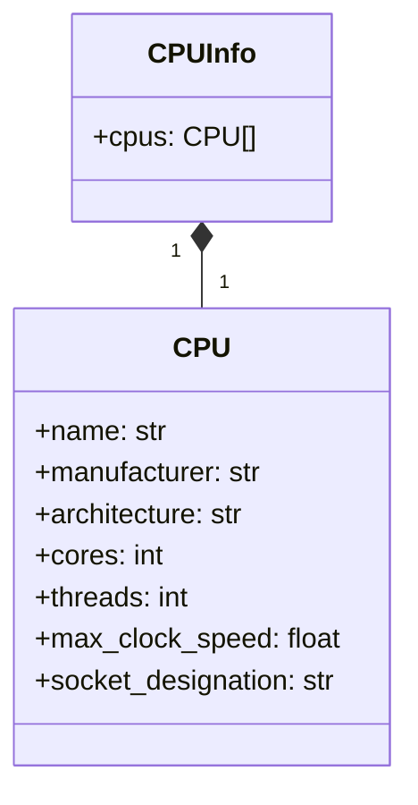
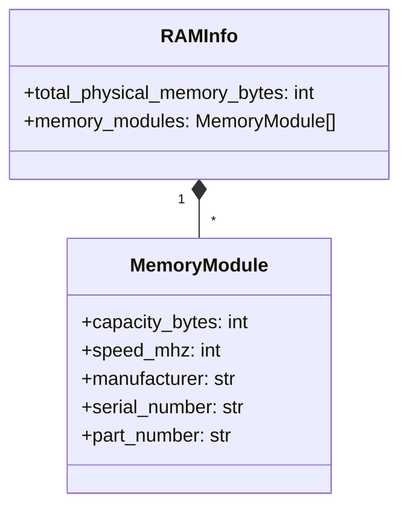
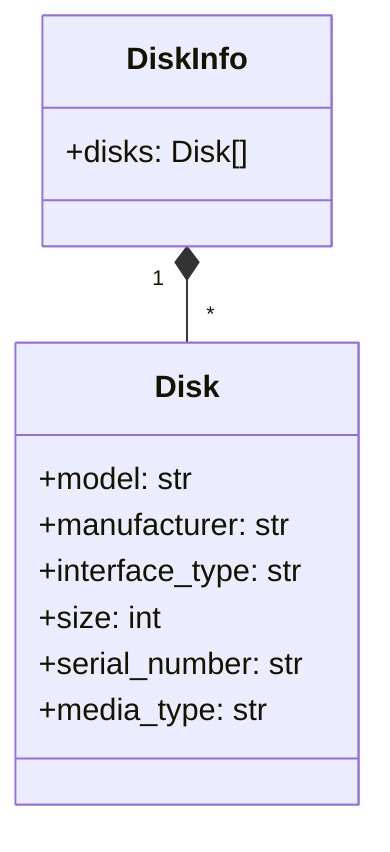

<p align="center">
<p align="center">
  
  
  
  
  
  
</p>

<p align="center">
  
  
</p>


<p align="center">
  
</p>

# HardView - Python Hardware Information Module

HardView is a high-performance, cross-platform Python module that provides detailed hardware and system information in structured JSON format. It supports both Windows (via WMI) and Linux (via sysfs/proc), and now includes advanced storage/SMART info and real-time performance monitoring.

## 🔑 Key Features

* 🖥️ **Comprehensive Hardware Data**: BIOS, System, Baseboard, Chassis, CPU, RAM, Disks, Network.
* 🏗️ **Advanced Storage & SMART**: Detailed disk, partition, and SMART attributes.
* 📊 **Performance Monitoring**: Real-time and interval-based CPU, RAM, and system performance.
* 🖥️ **Cross-Platform**: Works on Windows (WMI) and Linux (sysfs/proc).
* ⚡ **C Implementation**: High performance native code.
* 🐍 **Python Integration**: Easy-to-use Python API.
* 🧩 **Modular Design**: Extensible and well-documented.
* 📝 **Structured Output**: All results are returned as JSON strings or Python objects.

---

## 📦 Installation

### From PyPI

```bash
pip install hardview
```

### From Source

```bash
git clone https://github.com/gafoo173/hardview.git
cd hardview
pip install .
```

For supported platforms and full setup instructions, see `docs/INSTALL.md`.

---

## 🚀 Usage Example

```python
import HardView
import json

# JSON output
bios_json = HardView.get_bios_info()
cpu_json = HardView.get_cpu_info()

# Python objects output
bios_objects = HardView.get_bios_info_objects()
cpu_objects = HardView.get_cpu_info_objects()

# Performance monitoring
cpu_usage_json = HardView.get_cpu_usage()
ram_usage_objects = HardView.get_ram_usage_objects()

# Monitor over time
cpu_monitor_json = HardView.monitor_cpu_usage_duration(5, 1000)
ram_monitor_objects = HardView.monitor_ram_usage_duration_objects(3, 500)

# Pretty print CPU info
import pprint
pprint.pprint(json.loads(cpu_json))
```

---

## 📚 Documentation

All documentation is in the `docs/` folder:


* [`What.md`](./docs/What.md): **API Reference & Output Examples**
  Full explanation of every function, what info it returns, how to use it from Python, and real output samples.
* [`ARCHITECTURE.md`](./docs/ARCHITECTURE.md): **Technical Architecture**
  Deep dive into the internal structure, data flow, and design of HardView for developers and contributors.
* [`BENCHMARKS.md`](./docs/BENCHMARKS.md): **Performance & Feature Comparisons**
  Real-world speed benchmarks and feature comparisons with other Python libraries.
* [`INSTALL.md`](./docs/INSTALL.md): **Installation Guide**
  Supported platforms, installation methods, and troubleshooting tips.
* [`FAQ.md`](./docs/FAQ.md): **Frequently Asked Questions**
  Solutions to common installation, usage, and troubleshooting issues.
---

## 📖 API Reference (Summary)

| Function (JSON)                            | Function (Python Object)                           | Description                             |
| ------------------------------------------ | -------------------------------------------------- | --------------------------------------- |
| `get_bios_info()`                          | `get_bios_info_objects()`                          | BIOS vendor, version, release date      |
| `get_system_info()`                        | `get_system_info_objects()`                        | System manufacturer, product name, UUID |
| `get_baseboard_info()`                     | `get_baseboard_info_objects()`                     | Motherboard info                        |
| `get_chassis_info()`                       | `get_chassis_info_objects()`                       | Chassis/computer case info              |
| `get_cpu_info()`                           | `get_cpu_info_objects()`                           | Processor details                       |
| `get_ram_info()`                           | `get_ram_info_objects()`                           | Memory modules and totals               |
| `get_gpu_info`                             | `get_gpu_info_objects()`                           | GPU information                         |
| `get_disk_info()`                          | `get_disk_info_objects()`                          | Storage devices                         |
| `get_network_info()`                       | `get_network_info_objects()`                       | Network adapters                        |
| `get_partitions_info()`                    | `get_partitions_info_objects()`                    | Disk partitions (advanced)              |
| `get_smart_info()`                         | `get_smart_info_objects()`                         | Full disk/SMART info (advanced)         |
| `get_cpu_usage()`                          | `get_cpu_usage_objects()`                          | Current CPU usage                       |
| `get_ram_usage()`                          | `get_ram_usage_objects()`                          | Current RAM usage                       |
| `get_system_performance()`                 | `get_system_performance_objects()`                 | Combined CPU/RAM usage                  |
| `monitor_cpu_usage_duration(d, i)`         | `monitor_cpu_usage_duration_objects(d,i)`          | Monitor CPU usage over time             |
| `monitor_ram_usage_duration(d, i)`         | `monitor_ram_usage_duration_objects(d,i)`          | Monitor RAM usage over time             |
| `monitor_system_performance_duration(d,i)` | `monitor_system_performance_duration_objects(d,i)` | Monitor system performance over time    |

---

## 📊 Data Structure Diagrams

*(Uses mermaid.js diagrams in compatible renderers)*

### CPU Info



### Memory Info



### Disk Info



*(and so on for GPU, Network, Partition, SMART, Usage & Monitoring)*

---

## 🧪 Platform Support

| Feature                  | Windows | Linux|           
| ------------------------ | ------- | -----|
| BIOS Info                | ✅    | ✅    |
| System Info              | ✅    | ✅    |
| Baseboard Info           | ✅    | ✅    |
| Chassis Info             | ✅    | ✅    |
| CPU Info                 | ✅    | ✅    |
| RAM Info                 | ✅    | ✅    |
| Disks                    | ✅    | ✅    |
| Network                  | ✅    | ✅    |
| Advanced Storage / SMART | ✅    | 🚫    |
| Performance Monitoring   | ✅    | ✅    |

---

## 🚦 Performance Benchmarks

See `docs/BENCHMARKS.md` for detailed performance and feature comparison with other libraries.

---

## 🛠️ Development

### Build Instructions

**Windows:**

```bash
python setup.py build_ext --inplace
```

**Linux:**

```bash
python setup.py build_ext --inplace
```

### Dependencies

* Python 3.7+
* On Windows: WMI (included)
* On Linux: standard system libraries

---

## 📄 License

MIT License — Free for commercial and personal use.

---

## 🤝 Contribution

Contributions are welcome!

* Fork and submit pull requests
* Report issues or feature requests

---

**HardView — Your Window into Hardware Information**

See [`What.md`](./docs/What.md): for full API, architecture, and benchmarking docs.
