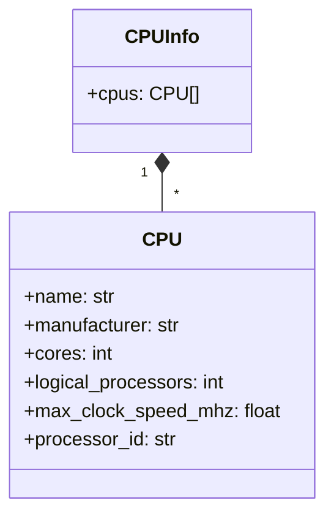
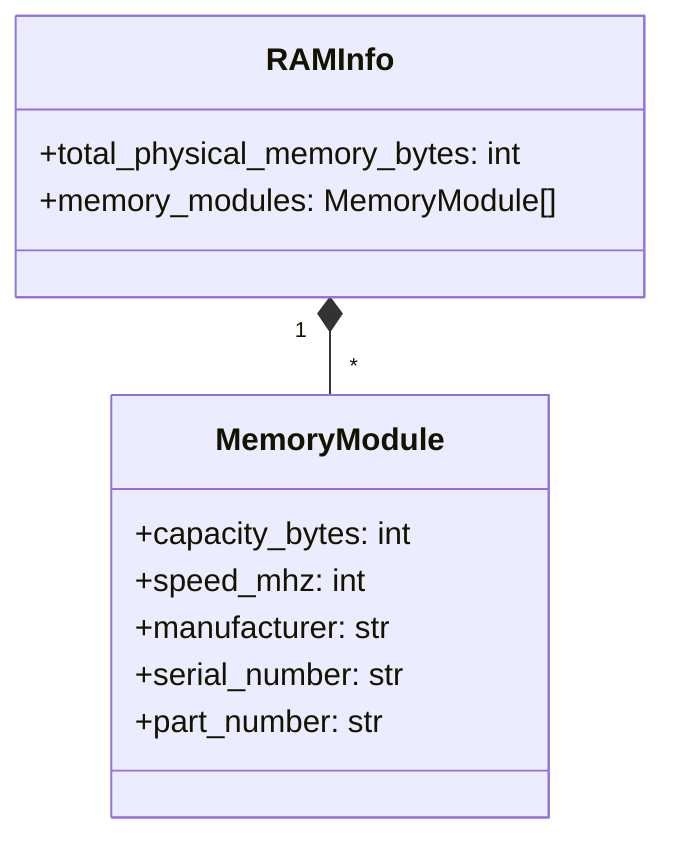

<p align="center">
  
  
  
  
</p>

<p align="center">
  
  
</p>


<p align="center">
  
</p>


# HardView - Python Hardware Information Module

HardView is a high-performance, cross-platform Python module that provides detailed hardware and system information in structured JSON format. It supports both Windows (via WMI) and Linux (via sysfs/proc), and now includes advanced storage/SMART info and real-time performance monitoring.

## Key Features

* 🖥️ **Comprehensive Hardware Data**: BIOS, System, Baseboard, Chassis, CPU, RAM, Disks, Network
* 🏗️ **Advanced Storage & SMART**: Detailed disk, partition, and SMART attributes
* 📊 **Performance Monitoring**: Real-time and interval-based CPU, RAM, and system performance (usage, monitoring)
* 🏗️ **Cross-Platform**: Works on Windows (WMI) and Linux (sysfs/proc)
* ⚡ **C Implementation**: High performance native code
* 🐍 **Python Integration**: Easy-to-use Python API
* 🧹 **Modular Design**: Extensible, well-documented, and easy to contribute to
* 📝 **Structured JSON Output**: All results are returned as JSON strings for easy parsing

## Installation

See [`docs/INSTALL.md`](./INSTALL.md) for supported platforms and installation instructions.

### From PyPI

```bash
pip install hardview
```

### From Source

```bash
git clone https://github.com/gafoo173/hardview.git
cd hardview
pip install .
```

## Usage Example

```python
import hardview
import json

# Get all hardware information
bios_info = json.loads(hardview.get_bios_info())
system_info = json.loads(hardview.get_system_info())
cpu_info = json.loads(hardview.get_cpu_info())
ram_info = json.loads(hardview.get_ram_info())
disk_info = json.loads(hardview.get_disk_info())
network_info = json.loads(hardview.get_network_info())

# Advanced features
smart_info = json.loads(hardview.get_smart_info())
partitions_info = json.loads(hardview.get_partitions_info())

# Performance monitoring
cpu_usage = json.loads(hardview.get_cpu_usage())
ram_usage = json.loads(hardview.get_ram_usage())
system_perf = json.loads(hardview.get_system_performance())

# Monitor over time
cpu_monitor = json.loads(hardview.monitor_cpu_usage(5, 1000))  # 5 seconds, 1s interval

# Pretty print CPU information
import pprint
pprint.pprint(cpu_info)
```

## Documentation

All documentation is in the `docs/` folder. Key files:

* [`What.md`](./What.md): **API Reference & Output Examples**
  Full explanation of every function, what info it returns, how to use it from Python, and real output samples.
* [`ARCHITECTURE.md`](./ARCHITECTURE.md): **Technical Architecture**
  Deep dive into the internal structure, data flow, and design of HardView for developers and contributors.
* [`BENCHMARKS.md`](./BENCHMARKS.md): **Performance & Feature Comparisons**
  Real-world speed benchmarks and feature comparisons with other Python libraries.
* [`INSTALL.md`](./INSTALL.md): **Installation Guide**
  Supported platforms, installation methods, and troubleshooting tips.
* [`FAQ.md`](./FAQ.md): **Frequently Asked Questions**
  Solutions to common installation, usage, and troubleshooting issues.

## API Reference (Summary)

| Function                                         | Description                             | Sample Output |
| ------------------------------------------------ | --------------------------------------- | ------------- |
| `get_bios_info()`                                | BIOS vendor, version, release date      | `{...}`       |
| `get_system_info()`                              | System manufacturer, product name, UUID | `{...}`       |
| `get_baseboard_info()`                           | Motherboard information                 | `{...}`       |
| `get_chassis_info()`                             | Chassis/computer case info              | `{...}`       |
| `get_cpu_info()`                                 | Processor details                       | `{...}`       |
| `get_ram_info()`                                 | Memory modules and totals               | `{...}`       |
| `get_disk_info()`                                | Storage devices                         | `{...}`       |
| `get_network_info()`                             | Network adapters                        | `{...}`       |
| `get_partitions_info()`                          | Disk partitions (advanced)              | `{...}`       |
| `get_smart_info()`                               | Full disk/SMART info (advanced)         | `{...}`       |
| `get_cpu_usage()`                                | Current CPU usage                       | `{...}`       |
| `get_ram_usage()`                                | Current RAM usage                       | `{...}`       |
| `get_system_performance()`                       | Combined CPU/RAM usage                  | `{...}`       |
| `monitor_cpu_usage(duration, interval)`          | Monitor CPU usage over time             | `[ ... ]`     |
| `monitor_ram_usage(duration, interval)`          | Monitor RAM usage over time             | `[ ... ]`     |
| `monitor_system_performance(duration, interval)` | Monitor system performance over time    | `[ ... ]`     |

See [`docs/What.md`](./What.md) for full details and output samples.

## Data Structure Diagrams

### CPU Information Structure



### Memory Information Structure



## Platform Support

| Feature                | Windows | Linux           |
| ---------------------- | ------- | --------------- |
| BIOS Info              | ✅ WMI   | ✅ sysfs         |
| System Info            | ✅ WMI   | ✅ sysfs         |
| Baseboard              | ✅ WMI   | ✅ sysfs         |
| Chassis                | ✅ WMI   | ✅ sysfs         |
| CPU                    | ✅ WMI   | ✅ /proc/cpuinfo |
| RAM                    | ✅ WMI   | ✅ /proc/meminfo |
| Disks                  | ✅ WMI   | ✅ /sys/block    |
| Network                | ✅ WMI   | ✅ getifaddrs    |
| Advanced Storage/SMART | ✅ WMI   |                 |
| Performance Monitoring | ✅       |                 |

## Performance Benchmarks

See [`docs/BENCHMARKS.md`](./BENCHMARKS.md) for detailed speed and feature comparisons with other libraries.

## Development

### Build Instructions

**Windows:**

```bash
python setup.py build_ext --inplace
```

**Linux:**

```bash
python setup.py build_ext --inplace
```

### Dependencies

* Python 3.6+
* On Windows: WMI libraries (automatically available)
* On Linux: Standard system libraries (libc, etc.)

## License

MIT License - Free for commercial and personal use.

## Contribution

Contributions are welcome! Please submit pull requests or open issues for features/bugs.

---

*HardView - Your Window into Hardware Information*
\*See docs/ for full API, technical, and comp
