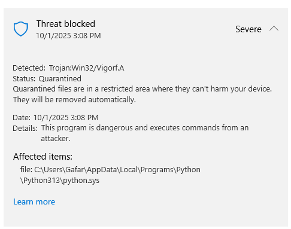
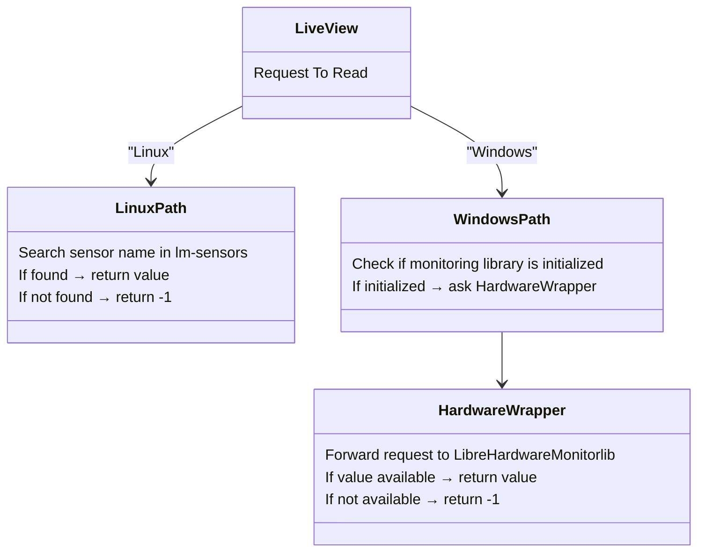

<div align="center">


# HardView - Hardware Information Project

<p>
  
  
  
</p>

<p>
  
  
  
</p>

<p>
  
</p>

<p align="center">
  <b>A comprehensive hardware monitoring solution with Python, C++, and C libraries</b><br>
  <i>Unified interface for developers • Real-time monitoring • Cross-platform support</i>
</p>

</div>

---

<div align="center">

## 📋 Table of Contents

[Overview](#-hardview-project-overview) • [Features](#-key-features) • [Installation](#-installation-python) • [Usage](#-usage-examples) • [Documentation](#-documentation) • [API Reference](#-api-reference-python) • [Platform Support](#platform-support) 

</div>

---

## 📦 HardView Project Overview

HardView is a project that includes Python, C++, and C libraries, Windows drivers, and tools for monitoring hardware and displaying its information through various sources, whether from the system or other libraries. It provides a unified interface for developers to access information via libraries and a user interface for end-users through the tools.

<details open>
<summary><b>Libraries & Components</b></summary>

<table>
<thead>
<tr>
<th width="200">Library Name</th>
<th>Description</th>
<th width="100">Language</th>
<th width="250">Purpose / Features</th>
</tr>
</thead>
<tbody>

<tr>
<td><a href="./HardView"><b>HardView</b></a></td>
<td><b>Legacy library</b> providing static hardware information for Windows and Linux.  
 Uses WMI and old query methods — kept for compatibility only.</td>
<td>C</td>
<td><b>Legacy (superseded by LiveView & SMBIOS)</b></td>
</tr>


<tr>
<td><a href="./HardView/LiveView"><b>LiveView</b></a></td>
<td>A <b>monitoring library</b> for both static hardware info and real-time data. Supports CPU temperature and regular usage on Windows and Linux</td>
<td>C++</td>
<td>Real-time monitoring of hardware metrics, integrates static info and CPUID functions.</td>
</tr>

<tr>
<td><a href="./HardwareWrapper"><b>HardwareWrapper</b></a></td>
<td>An <b>internal library</b> wrapping <code>LibreHardwareMonitorLib</code> with simple functions through C++/CLI, allowing use from C++. Primarily used by LiveView on Windows for temperature readings.</td>
<td>C++/CLI</td>
<td>Simplifies access to LibreHardwareMonitorLib, providing easy C++ usage for Windows sensor data.</td>
</tr>

<tr>
<td><a href="./cpuid"><b>cpuid</b></a></td>
<td>An <b>internal, header-only C++ library</b> providing easy helper functions to access most CPUID information. Used by LiveView for CPUID-related functionality.</td>
<td>C++</td>
<td>Lightweight, easy-to-integrate CPUID helper library for detailed processor information.</td>
</tr>

<tr>
<td><a href="./C++/Headers"><b>C++/Headers</b></a></td>
<td>A folder containing <b>header-only C++ libraries</b> like <code>SMART.hpp</code> (for SMART info) or <code>Live.hpp</code> (C++ header-only version of LiveView), and others.</td>
<td>C++</td>
<td>Header-only C++ modules for advanced hardware access and monitoring.</td>
</tr>

<tr>
<td><a href="./Drivers"><b>Drivers</b></a></td>
<td>A set of <b>Windows kernel drivers</b> granting access to low-level hardware functionality useful for monitoring. Each driver comes with a header-only C++ library for easier integration. These drivers are <b>not used</b> by the main HardView libraries (Python or C++) since they are unsigned. They are provided for those who wish to sign and use them, or for personal use with local build and test signing.</td>
<td>C/C++</td>
<td>Optional drivers for advanced hardware access under Windows. Not required for standard HardView usage.</td>
</tr>

<tr>
<td><a href="./Tools"><b>Tools</b></a></td>
<td>A collection of <b>CLI and GUI Python tools</b> that rely on HardView to display hardware information.</td>
<td>Python</td>
<td>Command-line and GUI utilities for interacting with hardware info provided by HardView.</td>
</tr>

</tbody>
</table>

</details>

---

## ✨ Key Features

<div align="center">

<table>
<tr>
<td width="50%" valign="top">

### 🔧 Hardware Information
- **Comprehensive Hardware Data**: BIOS, System, Baseboard, Chassis, CPU, RAM, Disks, Network, GPU
- **Advanced Storage & SMART**: Detailed disk, partition, and SMART attributes
- **Cross-Platform Support**: Windows and Linux compatibility

</td>
<td width="50%" valign="top">

### 📊 Performance Monitoring
- **Real-time Monitoring**: CPU, RAM, Disk, Network, GPU usage
- **Temperature & Sensors**: Live temperature, voltage, and fan speed readings

</td>
</tr>
<tr>
<td width="50%" valign="top">

### 💻 Implementation
- **C/C++ Core**: High performance native code
- **Python Integration**: Easy-to-use Python API
- **Header-Only Libraries**: Simple integration for C++ projects

</td>
<td width="50%" valign="top">

### 🌡️ Temperature Monitoring
**Windows**: Uses [LibreHardwareMonitor](https://github.com/LibreHardwareMonitor/LibreHardwareMonitor) (**MPL-2.0**)  
**Linux**: Uses [`lm-sensors`](https://github.com/lm-sensors/lm-sensors) (**LGPL-2.1-or-later**)  
See [`licenses/`](licenses/) for full license texts

</td>
</tr>
</table>

</div>

---

## 🚀 Installation (Python)

<table>
<tr>
<td width="50%">

### From PyPI

```bash
pip install hardview
```

</td>
<td width="50%">

### From Source

```bash
git clone https://github.com/gafoo173/hardview.git
cd hardview
pip install .
```

</td>
</tr>
</table>

<details>
<summary><b>📚 Full setup instructions and platform support</b></summary>

For supported platforms and full setup instructions, see `docs/INSTALL.md`.

</details>

---

## 📦 Dependencies

<details>
<summary><b>Python (Windows)</b></summary>

Requires `LibreHardwareMonitorLib.dll` and `HidSharp.dll`.  
These DLLs are included in the package, so no separate installation is needed.

#### Windows Temperature Information Features

The temperature information features in Windows specifically require the **MSVC Runtime**, namely the following DLLs on **64-bit systems**:

- `msvcp140.dll`
- `vcruntime140.dll`
- `vcruntime140_1.dll`

If you place these DLLs alongside HardwareWrapper.dll, the temperature-related functions will likely work properly even if you haven't installed the full MSVC runtime.  
*(This applies whether you are using the Python **LiveView** or the **HardwareTemp.dll** from the SDK; in all cases, these libraries are required.)*

**In HardView Python versions **3.2.0+**, these DLLs are already included alongside the package, so you don't need to place them manually.**

</details>

<details>
<summary><b>Python (Linux)</b></summary>

Requires the `lm-sensors` library to be installed for hardware monitoring.

</details>

<details>
<summary><b>C++ Libraries</b></summary>

Check the top of each library header file for listed dependencies.  
Most libraries have no external dependencies.  
Exception: `SPD.hpp` requires `InpOutx64.dll`.  
It is recommended to review the header file beginning for any dependency notes.

</details>

---

## ⚠️ Potential Issues on Windows

<details>
<summary><b>HardView.LiveView Temperature Features</b></summary>

The **temperature monitoring features** in `HardView.LiveView` rely on **LibreHardwareMonitorLib**, which in turn uses on **WinRing0**.  
WinRing0 is an old and well-known driver used for reading from **MSR**, **physical memory**, and other low-level hardware resources.  

#### The Problem
Unfortunately, **WinRing0 is now blocked by Windows**.  
This means you may encounter alerts from **Windows Defender** similar to this one:

<div align="center">

</div>

You'll notice that **`python.sys`** is reported as the suspicious driver.  
This has nothing to do with Python itself. What actually happens is:

- LibreHardwareMonitorLib, when creating its driver, names it as **`<ProgramName>.sys`**.  
- Since Python scripts run under **`python.exe`**, the driver ends up named **`python.sys`**.  
- In reality, this file is just the **WinRing0 driver** renamed.

#### Is It Dangerous?
- WinRing0 is just a driver that grants access to resources that normally require kernel-mode from user-mode. The danger only arises if a malicious program abuses it.  
- The driver created by LibreHardwareMonitorLib is **temporary**. It will be stop automatically when you restart your system.

**It's recommended to delete the driver using sc delete or remove its file after the program finishes, to prevent any malicious software from exploiting it.**

### Manually Stopping or Removing the Driver 

If you want to close or remove the driver manually after running your script/program:

1. Open **CMD as Administrator**.
2. Run the following command to stop the driver:

```bash
sc stop R0<ProgramName>
```

- For Python scripts:  
  ```bash
  sc stop R0Python
  ```
- For an executable program named `X.exe`:  
  ```bash
  sc stop R0X
  ```

3. To permanently delete the driver, run:

```bash
sc delete R0Python
```

</details>

---

## 💡 Usage Examples

<details>
<summary><b>HardView (Not recommended for monitoring in 3.1.0+. It's better to use LiveView)</b></summary>

```python
import HardView
import json

# JSON output
bios_json = HardView.get_bios_info()
cpu_json = HardView.get_cpu_info() #In Linux all outputs N/A in this function 

# Python objects output
#You must pass the parameter `false` in versions prior to 3.0.3, e.g. `HardView.get_bios_info_objects(false)`.

bios_objects = HardView.get_bios_info_objects() 
cpu_objects = HardView.get_cpu_info_objects() #On Linux, all outputs of this function show N/A It is recommended in 3.1.0+ to use the cpuid function from LiveView.PyLiveCPU.

# Performance monitoring
cpu_usage_json = HardView.get_cpu_usage()
ram_usage_objects = HardView.get_ram_usage_objects()

# Monitor over time
cpu_monitor_json = HardView.monitor_cpu_usage_duration(5, 1000)
ram_monitor_objects = HardView.monitor_ram_usage_duration_objects(3, 500) 

# Pretty print CPU info
import pprint
pprint.pprint(json.loads(cpu_json))
```

</details>

<details>
<summary><b>LiveView</b></summary>

```python
from HardView.LiveView import PyLiveCPU, PyLiveRam, PyLiveDisk, PyLiveNetwork
import time

# Initialize system monitors
cpu_monitor = PyLiveCPU()         # CPU usage monitor
ram_monitor = PyLiveRam()         # RAM usage monitor
disk_monitor = PyLiveDisk(mode=1) # Disk R/W speed monitor (mode 1 for MB/s)
net_monitor = PyLiveNetwork()     # Network traffic monitor

print("System Monitor - Single Reading")
print("-" * 40)

# Get system metrics with 1-second sampling interval
cpu_usage = cpu_monitor.get_usage(1000)           # CPU percentage
ram_usage = ram_monitor.get_usage()               # RAM percentage
disk_rw = disk_monitor.get_usage(1000)            # Returns [(Read MB/s), (Write MB/s)]
net_traffic = net_monitor.get_usage(1000, mode=0) # Total network MB/s

# Display current system status
print(f"CPU: {cpu_usage:5.1f}% | RAM: {ram_usage:5.1f}% | "
      f"Disk R/W: {disk_rw[0][1]:4.1f}/{disk_rw[1][1]:4.1f} MB/s | "
      f"Network: {net_traffic:6.3f} MB/s")
      
print("Monitoring complete.")
```

</details>

<details>
<summary><b>LiveView (temperature) - Requires admin privileges</b></summary>

```python
#!/usr/bin/env python3
import sys

# Check CPU temperature - single reading
if sys.platform == "win32":
    # Windows CPU temperature
    try:
        from HardView.LiveView import PyTempCpu
        cpu_temp = PyTempCpu()  # Auto-initialize
        temperature = cpu_temp.get_temp()
        print(f"CPU Temperature: {temperature:.1f}°C")
    except Exception as e:
        print(f"Windows temperature error: {e}")
        
elif sys.platform == "linux":
    # Linux CPU temperature  
    try:
        from HardView.LiveView import PyLinuxSensor
        sensor = PyLinuxSensor()
        temperature = sensor.getCpuTemp()
        if temperature > 0:
            print(f"CPU Temperature: {temperature:.1f}°C")
        else:
            print("CPU temperature not available")
    except Exception as e:
        print(f"Linux temperature error: {e}")
        
else:
    print("Unsupported platform")
```

</details>

<details>
<summary><b>SMBIOS - (3.2.0+) </b></summary>

```python
from HardView import smbios

# Get all system information
info = smbios.get_system_info()

# Display system details
print("=" * 60)
print("SYSTEM INFORMATION")
print("=" * 60)
print(f"Manufacturer:    {info.system.manufacturer}")
print(f"Product Name:    {info.system.product_name}")
print(f"Version:         {info.system.version}")
print(f"Serial Number:   {info.system.serial_number}")
print(f"UUID:            {info.system.uuid}")
print(f"SKU Number:      {info.system.sku_number}")
print(f"Family:          {info.system.family}")

print("\n" + "=" * 60)
print("BIOS INFORMATION")
print("=" * 60)
print(f"Vendor:          {info.bios.vendor}")
print(f"Version:         {info.bios.version}")
print(f"Release Date:    {info.bios.release_date}")
print(f"BIOS Version:    {info.bios.major_release}.{info.bios.minor_release}")

print("\n" + "=" * 60)
print("MOTHERBOARD INFORMATION")
print("=" * 60)
print(f"Manufacturer:    {info.baseboard.manufacturer}")
print(f"Product:         {info.baseboard.product}")
print(f"Version:         {info.baseboard.version}")
print(f"Serial Number:   {info.baseboard.serial_number}")
```

</details>

<details>
<summary><b>SMART  - Requires admin privileges (3.3.0+) </b></summary>

```python
from HardView import SMART

def generate_health_report(drive_number):
    try:
        reader = SMART.SmartReader(drive_number)
        
        print("\n" + "="*60)
        print(f"DRIVE HEALTH REPORT - {reader.drive_path}")
        print("="*60)
        
        # Basic Info
        print(f"\n Basic Information:")
        print(f"   Drive Type: {reader.get_drive_type()}")
        print(f"   SMART Valid: {reader.is_valid}")
        
        # Temperature
        temp = reader.get_temperature()
        if temp != -1:
            temp_status = "✓ Good" if temp < 50 else "  High"
            print(f"\n  Temperature: {temp}°C - {temp_status}")
        
        # Usage Statistics
        print(f"\n⏱️  Usage Statistics:")
        hours = reader.get_power_on_hours()
        print(f"   Power-On Hours: {hours} ({hours/24:.1f} days)")
        print(f"   Power Cycles: {reader.get_power_cycle_count()}")
        
        # Health Status
        print(f"\n💊 Health Status:")
        realloc = reader.get_reallocated_sectors_count()
        if realloc == 0:
            print(f"   Reallocated Sectors: ✓ None (Excellent)")
        else:
            print(f"   Reallocated Sectors:   {realloc} (Needs Attention)")
        
        # SSD Specific
        if reader.is_probably_ssd():
            print(f"\n SSD Information:")
            life = reader.get_ssd_life_left()
            if life != -1:
                life_status = "✓ Good" if life > 80 else "  Monitor" if life > 50 else " Critical"
                print(f"   Life Remaining: {life}% - {life_status}")
            
            written = reader.get_total_bytes_written()
            if written > 0:
                written_tb = written / (1024**4)
                print(f"   Total Written: {written_tb:.2f} TB")
            
            read = reader.get_total_bytes_read()
            if read > 0:
                read_tb = read / (1024**4)
                print(f"   Total Read: {read_tb:.2f} TB")
        
        print("\n" + "="*60 + "\n")
        
    except Exception as e:
        print(f"Error generating report: {e}")

# Generate reports for all drives
readers, errors = SMART.scan_all_drives()
for i, reader in enumerate(readers):
    generate_health_report(i)
```

</details>


<details>
<summary><b>SDK Temperature (Rust) - Requires admin privileges</b></summary>

```rust
//This code will work on Windows only.
use libloading::{Library, Symbol};
use std::os::raw::{c_double, c_int};

type InitFn = unsafe extern "C" fn() -> c_int;
type ShutdownFn = unsafe extern "C" fn();
type GetTempFn = unsafe extern "C" fn() -> c_double;
type UpdateFn = unsafe extern "C" fn();

// Check if required DLLs exist next to the executable
fn check_dependencies() -> Result<(), String> {
    let required_dlls = ["HardwareTemp.dll", "HardwareWrapper.dll", "LibreHardwareMonitorLib.dll", "HidSharp.dll"];
    
    let exe_dir = std::env::current_exe()
        .map_err(|e| format!("Failed to get executable path: {}", e))?
        .parent()
        .ok_or("Failed to get executable directory")?
        .to_owned();

    let mut missing = Vec::new();
    for dll in &required_dlls {
        if !exe_dir.join(dll).exists() {
            missing.push(*dll);
        }
    }

    if !missing.is_empty() {
        return Err(format!("Missing DLLs: {}", missing.join(", ")));
    }
    Ok(())
}

fn main() {
    // Check dependencies first
    if let Err(error) = check_dependencies() {
        eprintln!("Error: {}", error);
        return;
    }

    // Load the library from executable directory
    let exe_dir = std::env::current_exe().unwrap().parent().unwrap().to_owned();
    let dll_path = exe_dir.join("HardwareTemp.dll");
    
    let lib = unsafe { 
        Library::new(&dll_path).expect("Failed to load HardwareTemp.dll") 
    };

    unsafe {
        // Load required functions
        let init: Symbol<InitFn> = lib.get(b"InitHardwareTempMonitor\0").expect("InitHardwareTempMonitor not found");
        let get_cpu_temp: Symbol<GetTempFn> = lib.get(b"GetCpuTemperatureTemp\0").expect("GetCpuTemperatureTemp not found");
        let update: Symbol<UpdateFn> = lib.get(b"UpdateHardwareMonitorTemp\0").expect("UpdateHardwareMonitorTemp not found");
        let shutdown: Symbol<ShutdownFn> = lib.get(b"ShutdownHardwareTempMonitor\0").expect("ShutdownHardwareTempMonitor not found");

        // Initialize hardware monitor
        let init_result = init();
        if init_result != 0 {
            eprintln!("Failed to initialize hardware monitor. Error code: {}", init_result);
            return;
        }

        // Update and get CPU temperature
        update();
        let cpu_temp = get_cpu_temp();

        // Display result
        match cpu_temp {
            -1.0 => println!("CPU Temperature: ERROR - Run as Administrator or sensor not supported"),
            -99.0 => println!("CPU Temperature: ERROR - Missing dependencies"),
            temp => println!("CPU Temperature: {:.1} °C", temp),
        }

        // Cleanup
        shutdown();
    }
}
```

</details>

<details>
<summary><b>MSR.hpp Example (C++) - needs MsrDrv.sys installed and running</b></summary>

```cpp
//this code will work in intel only
#include "MSR.hpp"
#include <iostream>

int main() {
    try {
        // Create MSR driver instance
        MSR::MsrDriver driver;

        if (!driver.IsValid()) {
            std::cerr << "MSR driver not available!" << std::endl;
            return 1;
        }

        // Read CPU TjMax (maximum temperature)
        int tjMax = 0;
        if (MSR::Thermal::TryGetTjMax(driver, tjMax)) {
            std::cout << "CPU TjMax: " << tjMax << "°C" << std::endl;
        } else {
            std::cerr << "Failed to get TjMax." << std::endl;
        }

        // Read current CPU temperature
        int currentTemp = 0;
        if (MSR::Thermal::TryGetCurrentTemperature(driver, currentTemp)) {
            std::cout << "Current CPU Temperature: " << currentTemp << "°C" << std::endl;
        } else {
            std::cerr << "Failed to read CPU temperature." << std::endl;
        }

        // Read a specific MSR register (IA32_PLATFORM_ID)
        try {
            UINT64 platformId = driver.ReadMsr(MSR::Registers::IA32_PLATFORM_ID);
            std::cout << "IA32_PLATFORM_ID MSR: 0x" 
                      << std::hex << platformId << std::dec << std::endl;
        } catch (const MSR::MsrException& ex) {
            std::cerr << "Error reading MSR: " << ex.what() 
                      << " (code: " << ex.GetErrorCode() << ")" << std::endl;
        }

    } catch (const MSR::DriverNotLoadedException& ex) {
        std::cerr << "MSR driver not loaded: " << ex.what() << std::endl;
        return 2;
    } catch (const MSR::MsrException& ex) {
        std::cerr << "MSR Exception: " << ex.what() 
                  << " (code: " << ex.GetErrorCode() << ")" << std::endl;
        return 3;
    }

    return 0;
}
```

</details>

<details>
<summary><b>PhysMemDrv.hpp Example (C++) - needs PhysMemDrv.sys installed and running</b></summary>

```cpp
#include "PhysMemDrv.hpp"
#include <iostream>
#include <iomanip>

int main() {
    try {
        PhysMemDriver::DriverHandle driver;
        uint8_t firstByte = driver.ReadPhysical<uint8_t>(0xF0000);
        std::cout << "BIOS first byte: 0x" 
                  << std::hex << std::setw(2) << std::setfill('0') 
                  << static_cast<int>(firstByte) << std::dec << std::endl;
    } catch (...) {
        std::cerr << "Failed to read BIOS ROM" << std::endl;
    }
}
```

</details>

<details>
<summary><b>SMART.hpp Example (C++) - requires Admin privileges</b></summary>

```cpp
#include "SMART.hpp"
#include <iostream>
#include <vector>
#include <memory>

int main() {
    try {
        // Scan all available drives (0-7)
        auto drives = smart_reader::ScanAllDrives(8);

        for (const auto& drive : drives) {
            std::cout << "Drive: " << drive->GetDrivePath() << "\n";
            std::cout << "Type: " << drive->GetDriveType() << "\n";
            std::cout << "Temperature: " << drive->GetTemperature() << " °C\n";
            std::cout << "Power-On Hours: " << drive->GetPowerOnHours() << "\n";
            std::cout << "Power Cycle Count: " << drive->GetPowerCycleCount() << "\n";
            std::cout << "Reallocated Sectors: " << drive->GetReallocatedSectorsCount() << "\n";

            if (drive->IsProbablySsd()) {
                std::cout << "SSD Life Left: " << drive->GetSsdLifeLeft() << "%\n";
                std::cout << "Total Bytes Written: " << drive->GetTotalBytesWritten() << "\n";
                std::cout << "Total Bytes Read: " << drive->GetTotalBytesRead() << "\n";
                std::cout << "Wear Leveling Count: " << drive->GetWearLevelingCount() << "\n";
            }

            std::cout << "-------------------------------------\n";
        }
    } catch (const std::exception& e) {
        std::cerr << "Error reading SMART data: " << e.what() << std::endl;
    }
}
```

</details>

<details>
<summary><b>info.hpp (C++) - Linux Only</b></summary>

```cpp
#include "info.hpp"
#include <iostream>
using namespace LinuxInfo;

int main() {
    // Get CPU information
    auto cpuInfo = getCPUInfo();

    std::cout << "=== CPU Info ===\n";
    for (const auto& [key, value] : cpuInfo) {
        std::cout << key << ": " << value << "\n";
    }

    return 0;
}
```

</details>

---

## 📖 Documentation

<div align="center">

### Full documentation is available on the GitHub Pages website:

### 🌐 [https://gafoo173.github.io/HardView/](https://gafoo173.github.io/HardView/)

</div>

<details>
<summary><b>📁 Documentation Files</b></summary>

All documentation is in the `docs/` folder:

* [`What.md`](./docs/What.md): **API Reference & Output Examples**  
  Full explanation of every function, what info it returns, how to use it from Python, and real output samples.
* [`INSTALL.md`](./docs/INSTALL.md): **Installation Guide**  
  Supported platforms, installation methods, and troubleshooting tips.
* [`FAQ.md`](./docs/FAQ.md): **Frequently Asked Questions**  
  Solutions to common installation, usage, and troubleshooting issues.
* [`LiveViewAPI.md`](./docs/LiveViewAPI.md): **LiveView API Reference**  
  Detailed explanation of the LiveView module API, including functions, usage, and examples.
* [`LiveViewErrors.md`](./docs/LiveViewErrors.md): **LiveView Errors & Exceptions**  
  Guides and examples for handling errors and exceptions in the LiveView module.

</details>

---
## 📚 API Reference (Python)

<details>
<summary><b>HardView Functions</b></summary>

<table>
<thead>
<tr>
<th>Function (JSON)</th>
<th>Function (Python Object)</th>
<th>Description</th>
</tr>
</thead>
<tbody>

<tr>
<td><code>get_bios_info()</code></td>
<td><code>get_bios_info_objects()</code></td>
<td>BIOS vendor, version, release date</td>
</tr>

<tr>
<td><code>get_system_info()</code></td>
<td><code>get_system_info_objects()</code></td>
<td>System manufacturer, product name, UUID</td>
</tr>

<tr>
<td><code>get_baseboard_info()</code></td>
<td><code>get_baseboard_info_objects()</code></td>
<td>Motherboard info</td>
</tr>

<tr>
<td><code>get_chassis_info()</code></td>
<td><code>get_chassis_info_objects()</code></td>
<td>Chassis/computer case info</td>
</tr>

<tr>
<td><code>get_cpu_info()</code> <i>(Windows Only)</i></td>
<td><code>get_cpu_info_objects()</code> <i>(Windows Only)</i></td>
<td>Processor details</td>
</tr>

<tr>
<td><code>get_ram_info()</code></td>
<td><code>get_ram_info_objects()</code></td>
<td>Memory modules and totals</td>
</tr>

<tr>
<td><code>get_gpu_info()</code> <i>(Windows Only)</i></td>
<td><code>get_gpu_info_objects()</code> <i>(Windows Only)</i></td>
<td>GPU information</td>
</tr>

<tr>
<td><code>get_disk_info()</code></td>
<td><code>get_disk_info_objects()</code></td>
<td>Storage devices</td>
</tr>

<tr>
<td><code>get_network_info()</code></td>
<td><code>get_network_info_objects()</code></td>
<td>Network adapters</td>
</tr>

<tr>
<td><code>get_partitions_info()</code></td>
<td><code>get_partitions_info_objects()</code></td>
<td>Disk partitions (advanced)</td>
</tr>

<tr>
<td><code>get_cpu_usage()</code></td>
<td><code>get_cpu_usage_objects()</code></td>
<td>Current CPU usage</td>
</tr>

<tr>
<td><code>get_ram_usage()</code></td>
<td><code>get_ram_usage_objects()</code></td>
<td>Current RAM usage</td>
</tr>

<tr>
<td><code>get_system_performance()</code></td>
<td><code>get_system_performance_objects()</code></td>
<td>Combined CPU/RAM usage</td>
</tr>

<tr>
<td><code>monitor_cpu_usage_duration(d, i)</code></td>
<td><code>monitor_cpu_usage_duration_objects(d,i)</code></td>
<td>Monitor CPU usage over time</td>
</tr>

<tr>
<td><code>monitor_ram_usage_duration(d, i)</code></td>
<td><code>monitor_ram_usage_duration_objects(d,i)</code></td>
<td>Monitor RAM usage over time</td>
</tr>

<tr>
<td><code>monitor_system_performance_duration(d,i)</code></td>
<td><code>monitor_system_performance_duration_objects(d,i)</code></td>
<td>Monitor system performance over time</td>
</tr>

</tbody>
</table>

</details>

<details>
<summary><b>LiveView Classes & Methods</b></summary>

<table>
<thead>
<tr>
<th>Class.Method</th>
<th>Aliases</th>
<th>Description</th>
</tr>
</thead>
<tbody>

<tr>
<td><b><code>PyLiveCPU.get_usage(interval_ms)</code></b></td>
<td>---</td>
<td>Get total CPU usage % over a given interval.</td>
</tr>

<tr>
<td><b><code>PyLiveCPU.cpuid()</code></b></td>
<td><code>cpu_id()</code></td>
<td>Get CPU details via CPUID instruction.</td>
</tr>

<tr>
<td><b><code>PyLiveCPU.CpuSnapShot(...)</code></b> <i>(Windows)</i></td>
<td><code>cpu_snapshot(...)</code></td>
<td>Get raw CPU time counters for a specific core or number of cores.</td>
</tr>

<tr>
<td><b><code>PyLiveRam.get_usage(Raw=False)</code></b></td>
<td>---</td>
<td>Get total RAM usage % or raw <code>[used_bytes, total_bytes]</code>.</td>
</tr>

<tr>
<td><b><code>PyLiveDisk(mode)</code></b></td>
<td>---</td>
<td>Create disk monitor (mode=0 % usage [Windows], mode=1 R/W MB/s).</td>
</tr>

<tr>
<td><b><code>PyLiveDisk.get_usage(interval)</code></b></td>
<td>---</td>
<td>Get disk usage as % or <code>{Read MB/s, Write MB/s}</code>.</td>
</tr>

<tr>
<td><b><code>PyLiveDisk.HighDiskUsage(...)</code></b></td>
<td><code>high_disk_usage(...)</code></td>
<td>Check if disk R/W exceeds threshold.</td>
</tr>

<tr>
<td><b><code>PyLiveNetwork.get_usage(interval, mode=0)</code></b></td>
<td>---</td>
<td>Get total MB/s (mode 0) or per-interface MB/s (mode 1).</td>
</tr>

<tr>
<td><b><code>PyLiveNetwork.getHighCard()</code></b></td>
<td><code>get_high_card()</code></td>
<td>Get name of network adapter with highest usage.</td>
</tr>

<tr>
<td><b><code>PyLiveGpu.get_usage(interval_ms)</code></b> <i>(Windows)</i></td>
<td>---</td>
<td>Get total GPU usage %.</td>
</tr>

<tr>
<td><b><code>PyLiveGpu.get_average_usage(interval_ms)</code></b> <i>(Windows)</i></td>
<td>---</td>
<td>Get average GPU usage %.</td>
</tr>

<tr>
<td><b><code>PyLiveGpu.get_max_usage(interval_ms)</code></b> <i>(Windows)</i></td>
<td>---</td>
<td>Get maximum GPU usage %.</td>
</tr>

<tr>
<td><b><code>PyLiveGpu.get_counter_count()</code></b> <i>(Windows)</i></td>
<td>---</td>
<td>Get number of GPU counters monitored.</td>
</tr>

<tr>
<td><b><code>PyTempCpu.get_temp()</code></b> <i>(Windows)</i></td>
<td>---</td>
<td>Get current CPU temperature.</td>
</tr>

<tr>
<td><b><code>PyTempCpu.get_max_temp()</code></b> <i>(Windows)</i></td>
<td>---</td>
<td>Get max CPU core temperature.</td>
</tr>

<tr>
<td><b><code>PyTempCpu.get_avg_temp()</code></b> <i>(Windows)</i></td>
<td>---</td>
<td>Get average CPU core temperature.</td>
</tr>

<tr>
<td><b><code>PyTempCpu.get_fan_rpm()</code></b> <i>(Windows)</i></td>
<td>---</td>
<td>Get CPU fan RPM.</td>
</tr>

<tr>
<td><b><code>PyTempCpu.update()</code></b></td>
<td>---</td>
<td>Refresh CPU temperature & fan RPM.</td>
</tr>

<tr>
<td><b><code>PyTempCpu.reget()</code></b></td>
<td><code>re_get()</code></td>
<td>Re-read CPU temperature & fan RPM.</td>
</tr>

<tr>
<td><b><code>PyTempGpu.get_temp()</code></b> <i>(Windows)</i></td>
<td>---</td>
<td>Get current GPU temperature.</td>
</tr>

<tr>
<td><b><code>PyTempGpu.get_fan_rpm()</code></b> <i>(Windows)</i></td>
<td>---</td>
<td>Get GPU fan RPM.</td>
</tr>

<tr>
<td><b><code>PyTempGpu.update()</code></b></td>
<td>---</td>
<td>Refresh GPU temperature and fan RPM.</td>
</tr>

<tr>
<td><b><code>PyTempGpu.reget()</code></b></td>
<td><code>re_get()</code></td>
<td>Re-read GPU temperature and fan RPM.</td>
</tr>

<tr>
<td><b><code>PyTempOther.get_mb_temp()</code></b> <i>(Windows)</i></td>
<td>---</td>
<td>Get motherboard temperature.</td>
</tr>

<tr>
<td><b><code>PyTempOther.get_Storage_temp()</code></b> <i>(Windows)</i></td>
<td><code>get_storage_temp()</code></td>
<td>Get storage temperature.</td>
</tr>

<tr>
<td><b><code>PyTempOther.update()</code></b></td>
<td>---</td>
<td>Refresh other temperatures.</td>
</tr>

<tr>
<td><b><code>PyTempOther.reget()</code></b></td>
<td><code>re_get()</code></td>
<td>Re-read other temperatures.</td>
</tr>

<tr>
<td><b><code>PySensor.GetData(init=False)</code></b> <i>(Windows)</i></td>
<td><code>get_data(init=False)</code></td>
<td>Fetch sensors & fan data.</td>
</tr>

<tr>
<td><b><code>PySensor.GetValueByName(name)</code></b> <i>(Windows)</i></td>
<td><code>get_value_by_name(name)</code></td>
<td>Get sensor value by name.</td>
</tr>

<tr>
<td><b><code>PySensor.getAllSensors()</code></b> <i>(Windows)</i></td>
<td><code>get_all_sensors()</code></td>
<td>List all sensor names.</td>
</tr>

<tr>
<td><b><code>PySensor.getAllFanRPMs()</code></b> <i>(Windows)</i></td>
<td><code>get_all_fan_rpms()</code></td>
<td>List all fan RPM readings.</td>
</tr>

<tr>
<td><b><code>PySensor.update()</code></b></td>
<td>---</td>
<td>Refresh sensors & fans data.</td>
</tr>

<tr>
<td><b><code>PySensor.reget()</code></b></td>
<td><code>re_get()</code></td>
<td>Re-fetch sensors & fans data.</td>
</tr>

<tr>
<td><b><code>PyManageTemp.Init()</code></b> <i>(Windows)</i></td>
<td><code>init()</code></td>
<td>Initialize temperature monitoring.</td>
</tr>

<tr>
<td><b><code>PyManageTemp.Close()</code></b> <i>(Windows)</i></td>
<td><code>close()</code></td>
<td>Shutdown temperature monitoring.</td>
</tr>

<tr>
<td><b><code>PyManageTemp.Update()</code></b> <i>(Windows)</i></td>
<td><code>update()</code></td>
<td>Update all temperature data.</td>
</tr>

<tr>
<td><b><code>PyRawInfo.RSMB()</code></b> <i>(Windows)</i></td>
<td><code>rsmb()</code></td>
<td>Get raw SMBIOS table bytes.</td>
</tr>

<tr>
<td><b><code>PyLinuxSensor.getCpuTemp()</code></b> <i>(Linux)</i></td>
<td><code>get_cpu_temp()</code></td>
<td>Get CPU temperature.</td>
</tr>

<tr>
<td><b><code>PyLinuxSensor.getChipsetTemp()</code></b> <i>(Linux)</i></td>
<td><code>get_chipset_temp()</code></td>
<td>Get chipset temperature.</td>
</tr>

<tr>
<td><b><code>PyLinuxSensor.getMotherboardTemp()</code></b> <i>(Linux)</i></td>
<td><code>get_motherboard_temp()</code></td>
<td>Get motherboard temperature.</td>
</tr>

<tr>
<td><b><code>PyLinuxSensor.getVRMTemp()</code></b> <i>(Linux)</i></td>
<td><code>get_vrm_temp()</code></td>
<td>Get VRM/memory temperature.</td>
</tr>

<tr>
<td><b><code>PyLinuxSensor.getDriveTemp()</code></b> <i>(Linux)</i></td>
<td><code>get_drive_temp()</code></td>
<td>Get storage temperature.</td>
</tr>

<tr>
<td><b><code>PyLinuxSensor.getAllSensorNames()</code></b> <i>(Linux)</i></td>
<td><code>get_all_sensor_names()</code></td>
<td>List all sensor names.</td>
</tr>

<tr>
<td><b><code>PyLinuxSensor.findSensorName(name)</code></b> <i>(Linux)</i></td>
<td><code>find_sensor_name(name)</code></td>
<td>Search for a sensor name.</td>
</tr>

<tr>
<td><b><code>PyLinuxSensor.GetSensorTemp(name, Match)</code></b> <i>(Linux)</i></td>
<td><code>get_sensor_temp(name, Match)</code></td>
<td>Get sensor temperature by name.</td>
</tr>

<tr>
<td><b><code>PyLinuxSensor.GetSensorsWithTemp()</code></b> <i>(Linux)</i></td>
<td><code>get_sensors_with_temp()</code></td>
<td>Get all sensors with their temperatures.</td>
</tr>

<tr>
<td><b><code>PyLinuxSensor.update(names=False)</code></b> <i>(Linux)</i></td>
<td>---</td>
<td>Refresh sensor readings.</td>
</tr>

</tbody>
</table>

</details>

<details>
<summary><b>SMART Module (3.3.0+)</b></summary>

### Main Classes

<table>
<thead>
<tr>
<th>Class</th>
<th>Properties</th>
<th>Description</th>
</tr>
</thead>
<tbody>

<tr>
<td><b><code>SmartReader</code></b></td>
<td><code>is_valid, drive_path, revision_number, valid_attributes, raw_data</code></td>
<td>Main SMART data reader for physical drives</td>
</tr>

<tr>
<td><b><code>SmartAttribute</code></b></td>
<td><code>id, flags, current, worst, raw_value, name</code></td>
<td>Individual SMART attribute data</td>
</tr>

<tr>
<td><b><code>SmartValues</code></b></td>
<td><code>revision_number, offline_data_collection_status, self_test_execution_status, total_time_to_complete_offline_data_collection</code></td>
<td>SMART values structure</td>
</tr>

</tbody>
</table>

### SmartReader Methods

<table>
<thead>
<tr>
<th>Method</th>
<th>Parameters</th>
<th>Description</th>
</tr>
</thead>
<tbody>

<tr>
<td><b><code>SmartReader(drive_number)</code></b></td>
<td><code>drive_number: int</code></td>
<td>Create SMART reader for physical drive number (0, 1, 2, ...)</td>
</tr>

<tr>
<td><b><code>SmartReader(drive_path)</code></b></td>
<td><code>drive_path: str</code></td>
<td>Create SMART reader for drive path (e.g., '\\\\.\\PhysicalDrive0')</td>
</tr>

<tr>
<td><b><code>refresh()</code></b></td>
<td>---</td>
<td>Refresh SMART data from drive</td>
</tr>

<tr>
<td><b><code>find_attribute(attribute_id)</code></b></td>
<td><code>attribute_id: int</code></td>
<td>Find specific attribute by ID</td>
</tr>

<tr>
<td><b><code>get_temperature()</code></b></td>
<td>---</td>
<td>Get drive temperature in Celsius (-1 if not available)</td>
</tr>

<tr>
<td><b><code>get_power_on_hours()</code></b></td>
<td>---</td>
<td>Get power-on hours (0 if not available)</td>
</tr>

<tr>
<td><b><code>get_power_cycle_count()</code></b></td>
<td>---</td>
<td>Get power cycle count (0 if not available)</td>
</tr>

<tr>
<td><b><code>get_reallocated_sectors_count()</code></b></td>
<td>---</td>
<td>Get reallocated sectors count (0 if not available)</td>
</tr>

<tr>
<td><b><code>get_ssd_life_left()</code></b></td>
<td>---</td>
<td>Get SSD life remaining percentage (-1 if not available)</td>
</tr>

<tr>
<td><b><code>get_total_bytes_written()</code></b></td>
<td>---</td>
<td>Get total bytes written (SSD only, 0 if not available)</td>
</tr>

<tr>
<td><b><code>get_total_bytes_read()</code></b></td>
<td>---</td>
<td>Get total bytes read (SSD only, 0 if not available)</td>
</tr>

<tr>
<td><b><code>get_wear_leveling_count()</code></b></td>
<td>---</td>
<td>Get wear leveling count (SSD only, 0 if not available)</td>
</tr>

<tr>
<td><b><code>is_probably_ssd()</code></b></td>
<td>---</td>
<td>Check if drive is likely an SSD</td>
</tr>

<tr>
<td><b><code>is_probably_hdd()</code></b></td>
<td>---</td>
<td>Check if drive is likely an HDD</td>
</tr>

<tr>
<td><b><code>get_drive_type()</code></b></td>
<td>---</td>
<td>Get drive type as string ('SSD', 'HDD', or 'Unknown')</td>
</tr>

</tbody>
</table>

### Utility Functions

<table>
<thead>
<tr>
<th>Function</th>
<th>Parameters</th>
<th>Returns</th>
<th>Description</th>
</tr>
</thead>
<tbody>

<tr>
<td><b><code>scan_all_drives(max_drives)</code></b></td>
<td><code>max_drives: int = 8</code></td>
<td><code>([SmartReader, ...], [(drive_num, error_msg), ...])</code></td>
<td>Scan all available drives and return tuple of readers list and errors list</td>
</tr>

</tbody>
</table>

</details>

<details>
<summary><b>SMBIOS Module</b></summary>

### Main Classes

<table>
<thead>
<tr>
<th>Class</th>
<th>Properties</th>
<th>Description</th>
</tr>
</thead>
<tbody>

<tr>
<td><b><code>SMBIOSParser</code></b></td>
<td>---</td>
<td>Main parser for SMBIOS firmware data</td>
</tr>

<tr>
<td><b><code>BIOSInfo</code></b></td>
<td><code>vendor, version, release_date, major_release, minor_release, characteristics, rom_size</code></td>
<td>BIOS vendor, version, release date, ROM size</td>
</tr>

<tr>
<td><b><code>SystemInfo</code></b></td>
<td><code>manufacturer, product_name, version, serial_number, uuid, sku_number, family, wake_up_type</code></td>
<td>System manufacturer, product, UUID, serial number</td>
</tr>

<tr>
<td><b><code>BaseboardInfo</code></b></td>
<td><code>manufacturer, product, version, serial_number, asset_tag, feature_flags, board_type</code></td>
<td>Motherboard manufacturer, product, version</td>
</tr>

<tr>
<td><b><code>SystemEnclosureInfo</code></b></td>
<td><code>manufacturer, version, serial_number, asset_tag, chassis_type, bootup_state, power_supply_state, thermal_state, security_status, height</code></td>
<td>Chassis type, thermal state, security status</td>
</tr>

<tr>
<td><b><code>ProcessorInfo</code></b></td>
<td><code>socket_designation, manufacturer, version, serial_number, asset_tag, part_number, processor_type, processor_family, processor_id, max_speed, current_speed, core_count, thread_count, characteristics</code></td>
<td>CPU details, cores, threads, speeds</td>
</tr>

<tr>
<td><b><code>MemoryInfo</code></b></td>
<td><code>device_locator, bank_locator, manufacturer, serial_number, asset_tag, part_number, size_mb, speed, memory_type, form_factor, type_detail</code></td>
<td>RAM module details, size, speed, type</td>
</tr>

<tr>
<td><b><code>CacheInfo</code></b></td>
<td><code>socket_designation, cache_configuration, maximum_cache_size, installed_size, cache_speed, error_correction_type, system_cache_type, associativity</code></td>
<td>CPU cache levels and sizes</td>
</tr>

<tr>
<td><b><code>PortConnectorInfo</code></b></td>
<td><code>internal_reference_designator, external_reference_designator, internal_connector_type, external_connector_type, port_type</code></td>
<td>Physical port connectors information</td>
</tr>

<tr>
<td><b><code>SystemSlotInfo</code></b></td>
<td><code>slot_designation, slot_type, slot_data_bus_width, current_usage, slot_length, slot_id</code></td>
<td>Expansion slots (PCIe, PCI, etc.)</td>
</tr>

<tr>
<td><b><code>PhysicalMemoryArrayInfo</code></b></td>
<td><code>location, use, memory_error_correction, maximum_capacity, number_of_memory_devices</code></td>
<td>Memory array capacity and configuration</td>
</tr>

<tr>
<td><b><code>PortableBatteryInfo</code></b></td>
<td><code>location, manufacturer, manufacture_date, serial_number, device_name, device_chemistry, design_capacity, design_voltage</code></td>
<td>Battery capacity, chemistry, voltage</td>
</tr>

<tr>
<td><b><code>TemperatureProbeInfo</code></b></td>
<td><code>description, location_and_status, maximum_value, minimum_value, nominal_value</code></td>
<td>Temperature sensor information</td>
</tr>

<tr>
<td><b><code>VoltageProbeInfo</code></b></td>
<td><code>description, location_and_status, maximum_value, minimum_value, nominal_value</code></td>
<td>Voltage probe information</td>
</tr>

<tr>
<td><b><code>CoolingDeviceInfo</code></b></td>
<td><code>description, device_type_and_status, nominal_speed</code></td>
<td>Cooling device and fan information</td>
</tr>

<tr>
<td><b><code>SMBIOSInfo</code></b></td>
<td><code>major_version, minor_version, bios, system, baseboard, system_enclosure, physical_memory_array, processors[], memory_devices[], caches[], port_connectors[], system_slots[], batteries[], temperature_probes[], voltage_probes[], cooling_devices[], oem_strings[]</code></td>
<td>Complete SMBIOS information container</td>
</tr>

</tbody>
</table>

### SMBIOSParser Methods

<table>
<thead>
<tr>
<th>Method</th>
<th>Parameters</th>
<th>Description</th>
</tr>
</thead>
<tbody>

<tr>
<td><b><code>load_smbios_data()</code></b></td>
<td>---</td>
<td>Load SMBIOS data from system firmware</td>
</tr>

<tr>
<td><b><code>parse_smbios_data()</code></b></td>
<td>---</td>
<td>Parse the loaded SMBIOS data</td>
</tr>

<tr>
<td><b><code>get_parsed_info()</code></b></td>
<td>---</td>
<td>Get parsed SMBIOS information (returns SMBIOSInfo)</td>
</tr>

<tr>
<td><b><code>get_memory_type_string(type)</code></b></td>
<td><code>type: int</code></td>
<td>Convert memory type code to string (DDR4, DDR5, etc.)</td>
</tr>

<tr>
<td><b><code>get_form_factor_string(factor)</code></b></td>
<td><code>factor: int</code></td>
<td>Convert form factor code to string (DIMM, SODIMM, etc.)</td>
</tr>

<tr>
<td><b><code>get_processor_type_string(type)</code></b></td>
<td><code>type: int</code></td>
<td>Convert processor type code to string</td>
</tr>

<tr>
<td><b><code>get_chassis_type_string(type)</code></b></td>
<td><code>type: int</code></td>
<td>Convert chassis type code to string (Desktop, Laptop, etc.)</td>
</tr>

<tr>
<td><b><code>get_slot_type_string(type)</code></b></td>
<td><code>type: int</code></td>
<td>Convert slot type code to string (PCIe, PCI, etc.)</td>
</tr>

<tr>
<td><b><code>get_connector_type_string(type)</code></b></td>
<td><code>type: int</code></td>
<td>Convert connector type code to string</td>
</tr>

<tr>
<td><b><code>get_port_type_string(type)</code></b></td>
<td><code>type: int</code></td>
<td>Convert port type code to string (USB, HDMI, etc.)</td>
</tr>

<tr>
<td><b><code>get_cache_type_string(type)</code></b></td>
<td><code>type: int</code></td>
<td>Convert cache type code to string (L1, L2, L3, etc.)</td>
</tr>

<tr>
<td><b><code>get_battery_chemistry_string(chem)</code></b></td>
<td><code>chem: int</code></td>
<td>Convert battery chemistry code to string</td>
</tr>

<tr>
<td><b><code>get_last_error_as_string()</code></b> <i>(static)</i></td>
<td>---</td>
<td>Get last Windows error as string</td>
</tr>

</tbody>
</table>

### Convenience Functions

<table>
<thead>
<tr>
<th>Function</th>
<th>Returns</th>
<th>Description</th>
</tr>
</thead>
<tbody>

<tr>
<td><b><code>parse_smbios()</code></b></td>
<td><code>(SMBIOSParser, SMBIOSInfo)</code></td>
<td>Quick function to parse SMBIOS and return parser and info tuple</td>
</tr>

<tr>
<td><b><code>get_system_info()</code></b></td>
<td><code>SMBIOSInfo</code></td>
<td>Quick function to get complete SMBIOS system information</td>
</tr>

</tbody>
</table>

</details>

---

## 📊 Sensor Value Fetch Flow (LiveView)

<div align="center">



</div>

---

## Platform Support

<div align="center">

<table>
<thead>
<tr>
<th width="300">Feature</th>
<th width="150">Windows</th>
<th width="150">Linux</th>
</tr>
</thead>
<tbody>

<tr>
<td><b>BIOS Info</b></td>
<td>✅ yes</td>
<td>✅ yes</td>
</tr>

<tr>
<td><b>System Info</b></td>
<td>✅ yes</td>
<td>✅ yes</td>
</tr>

<tr>
<td><b>Baseboard Info</b></td>
<td>✅ yes</td>
<td>✅ yes</td>
</tr>

<tr>
<td><b>Chassis Info</b></td>
<td>✅ yes</td>
<td>✅ yes</td>
</tr>

<tr>
<td><b>CPU Info</b></td>
<td>✅ yes</td>
<td>✅ yes (by LiveView)</td>
</tr>

<tr>
<td><b>RAM Info</b></td>
<td>✅ yes</td>
<td>✅ yes</td>
</tr>

<tr>
<td><b>Disks</b></td>
<td>✅ yes</td>
<td>✅ yes</td>
</tr>

<tr>
<td><b>Network</b></td>
<td>✅ yes</td>
<td>✅ yes</td>
</tr>

<tr>
<td><b>Advanced Storage / SMART</b></td>
<td>✅ yes</td>
<td>❌ No</td>
</tr>

<tr>
<td><b>Performance Monitoring</b></td>
<td>✅ yes</td>
<td>✅ yes</td>
</tr>

<tr>
<td><b>Sensors</b></td>
<td>✅ yes (by LiveView)</td>
<td>✅ yes (by LiveView)</td>
</tr>

</tbody>
</table>

</div>

---

## 🛠️ Development

### Build Instructions

<table>
<tr>
<td width="50%">

#### Windows

```bash
python setup.py build_ext --inplace
```

</td>
<td width="50%">

#### Linux

```bash
python setup.py build_ext --inplace
```

</td>
</tr>
</table>

---

## 📄 License

<div align="center">

<table>
<tr>
<td width="50%" valign="top">

### Core Project (HardView)
All core project files, including project-specific libraries and header files are licensed under the **MIT License**. They are free for both personal and commercial use.

</td>
<td width="50%" valign="top">

### Tools Folder
All tools in the **Tools** folder are licensed under: GNU GENERAL PUBLIC LICENSE **(GPL-3)**.  
You can read the full license terms in the file: [LICENSE.GPL3](./LICENSE.GPL3).

</td>
</tr>
</table>

</div>

---

## 🧪 Quick Start And Tests

<div align="center">
  
### LiveView Tests

The LiveView test files are located in [tests/units](https://github.com/gafoo173/HardView/blob/main/tests/units)

</div>

---

## 🤝 Contribution

<div align="center">

**Contributions are welcome!**

<table>
<tr>
<td align="center" width="50%">

### 🔀 Fork & Pull Requests
Fork the repository and submit pull requests with your improvements

</td>
<td align="center" width="50%">

### 🐛 Issues & Features
Report issues or request features through GitHub Issues

</td>
</tr>
</table>

</div>

---

<div align="center">

## 🌟 HardView — Your Window into Hardware Information

<p>
<b>See</b> <a href="./docs/What.md"><code>HardView API</code></a> for the full HardView API<br>
<b>See</b> <a href="./docs/LiveViewAPI.md"><code>LiveView API</code></a> for the full LiveView API
</p>

---

<p>
  <i>Made with ❤️ for hardware enthusiasts and developers</i>
</p>

</div>


