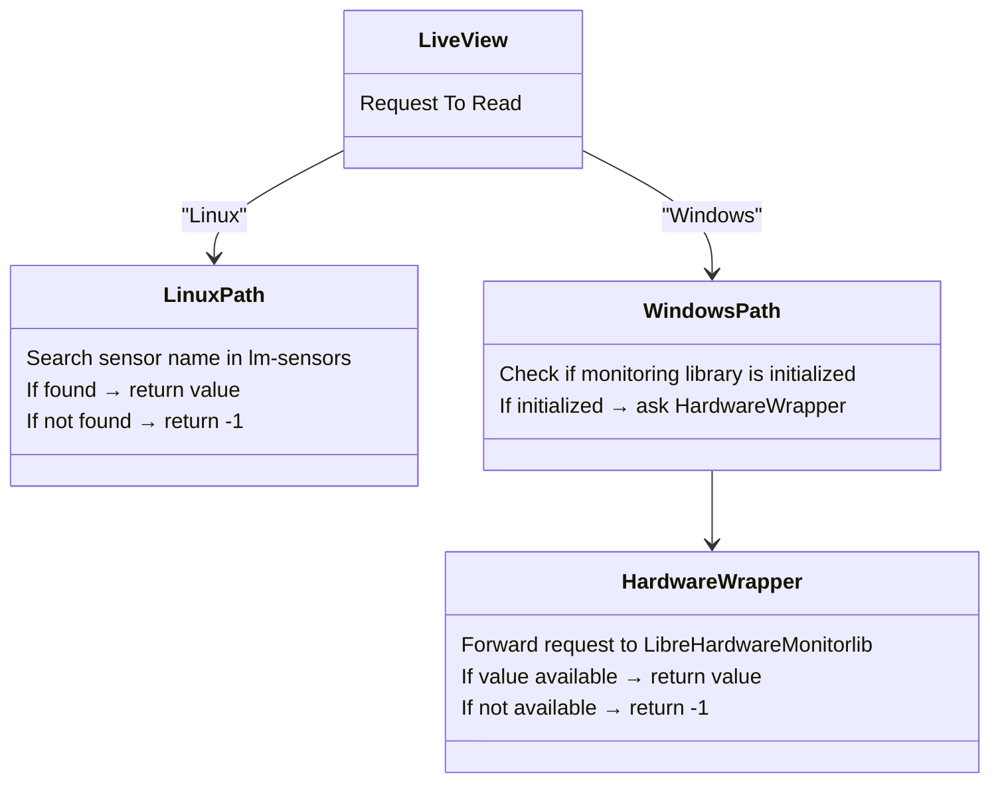

<div align="center">


# HardView - Hardware Information Project

<p align="center">
  <a href="https://pypi.org/project/HardView/">
    
  </a>
  <a href="https://pypi.org/project/HardView/4.0.0b1/">
    
  </a>
  <a href="https://docs.python.org/3/">
    
  </a>
  <a href="https://gafoo173.github.io/HardView/">
    
  </a>
  <a href="https://github.com/gafoo173/HardView/blob/main/LICENSE">
    
  </a>
</p>

<p>
  
  
  

<p align="center">
  <b>A comprehensive hardware monitoring solution with Python, C++, and C libraries</b><br>
  <i>Unified interface for developers • Real-time monitoring • Cross-platform support</i>
</p>

</div>

---

<div align="center">

## 📋 Table of Contents

[Overview](#-hardview-project-overview) • [Features](#-key-features) • [Installation](#-installation-python) • [Usage](#-usage-examples) • [Documentation](#-documentation) • [API Reference](#-api-reference-python) • [Platform Support](#platform-support) 

</div>

---

## 🧪 Quick Start

Install HardView from PyPI:

```bash
pip install "HardView>=4.0.0"
```

Then download `tests/quick_start.py` from this repository and run:

```bash
python quick_start.py
```

Or clone the repository and install HardView locally:

```bash
git clone https://github.com/gafoo173/HardView.git
cd HardView
pip install .
python tests/quick_start.py
```

---

## 📦 HardView Project Overview

HardView is a project that includes Python, C++, and C libraries, Windows drivers, and tools for monitoring hardware and displaying its information through various sources, whether from the system or other libraries. It provides a unified interface for developers to access information via libraries and a user interface for end-users through the tools.

<details open>
<summary><b>Libraries & Components</b></summary>

<table>
<thead>
<tr>
<th width="200">Library Name</th>
<th>Description</th>
<th width="100">Language</th>
<th width="250">Purpose / Features</th>
</tr>
</thead>
<tbody>


<tr>
<td><a href="./HardView/LiveView"><b>LiveView</b></a></td>
<td>A <b>monitoring library</b> for both static hardware info and real-time data. Supports CPU temperature and regular usage on Windows and Linux</td>
<td>C++</td>
<td>Real-time monitoring of hardware metrics, integrates static info and CPUID functions.</td>
</tr>

<tr>
<td><a href="./HardwareWrapper"><b>HardwareWrapper</b></a></td>
<td>An <b>internal library</b> wrapping <code>LibreHardwareMonitorLib</code> with simple functions through C++/CLI, allowing use from C++. Primarily used by LiveView on Windows for temperature readings.</td>
<td>C++/CLI</td>
<td>Simplifies access to LibreHardwareMonitorLib, providing easy C++ usage for Windows sensor data.</td>
</tr>

<tr>
<td><a href="./cpuid"><b>cpuid</b></a></td>
<td>An <b>internal, header-only C++ library</b> providing easy helper functions to access most CPUID information. Used by LiveView for CPUID-related functionality.</td>
<td>C++</td>
<td>Lightweight, easy-to-integrate CPUID helper library for detailed processor information.</td>
</tr>

<tr>
<td><a href="./C++/Headers"><b>C++/Headers</b></a></td>
<td>A folder containing <b>header-only C++ libraries</b> like <code>SMART.hpp</code> (for SMART info) or <code>Live.hpp</code> (C++ header-only version of LiveView), and others.</td>
<td>C++</td>
<td>Header-only C++ modules for advanced hardware access and monitoring.</td>
</tr>

<tr>
<td><a href="./Drivers"><b>Drivers</b></a></td>
<td>A set of <b>Windows kernel drivers</b> granting access to low-level hardware functionality useful for monitoring. Each driver comes with a header-only C++ library for easier integration. These drivers are <b>not used</b> by the main HardView libraries (Python or C++) since they are unsigned. They are provided for those who wish to sign and use them, or for personal use with local build and test signing.</td>
<td>C/C++</td>
<td>Optional drivers for advanced hardware access under Windows. Not required for standard HardView usage.</td>
</tr>

<tr>
<td><a href="./HardView"><b>HardView</b></a></td>
<td><b>Legacy library</b> providing static hardware information for Windows and Linux.  
 Uses WMI and old query methods — kept for compatibility only.</td>
<td>C</td>
<td><b>Legacy (superseded by LiveView & SMBIOS)</b></td>
</tr>

<tr>
<td><a href="./Tools"><b>Tools</b></a></td>
<td>A collection of <b>CLI and GUI Python tools</b> that rely on HardView to display hardware information.</td>
<td>Python</td>
<td>Command-line and GUI utilities for interacting with hardware info provided by HardView.</td>
</tr>

</tbody>
</table>

</details>

---

## ✨ Key Features

<div align="center">

<table>
<tr>
<td width="50%" valign="top">

### 🔧 Hardware Information
- **Comprehensive Hardware Data**: BIOS, System, Baseboard, Chassis, CPU, RAM, Disks, Network, GPU
- **Advanced Storage & SMART**: Detailed disk, partition, and SMART attributes
- **Cross-Platform Support**: Windows and Linux compatibility

</td>
<td width="50%" valign="top">

### 📊 Performance Monitoring
- **Real-time Monitoring**: CPU, RAM, Disk, Network, GPU usage
- **Temperature & Sensors**: Live temperature, voltage, and fan speed readings

</td>
</tr>
<tr>
<td width="50%" valign="top">

### 💻 Implementation
- **C/C++ Core**: High performance native code
- **Python Integration**: Easy-to-use Python API
- **Header-Only Libraries**: Simple integration for C++ projects

</td>
<td width="50%" valign="top">

### 🌡️ Temperature Monitoring
- **Windows**: Uses [LibreHardwareMonitor](https://github.com/LibreHardwareMonitor/LibreHardwareMonitor) 
- **Linux**: Uses [`lm-sensors`](https://github.com/lm-sensors/lm-sensors) 
</td>
</tr>
</table>

</div>

---

## 🚀 Installation (Python)

<table>
<tr>
<td width="50%">

### From PyPI

```bash
pip install hardview
```

</td>
<td width="50%">

### From Source

```bash
git clone https://github.com/gafoo173/hardview.git
cd hardview
pip install .
```

</td>
</tr>
</table>

<details>
<summary><b>📚 Full setup instructions and platform support</b></summary>

For supported platforms and full setup instructions, see `docs/INSTALL.md`.

</details>

---

## 📦 Dependencies

<details>
<summary><b>Python (Windows)</b></summary>

Requires `LibreHardwareMonitorLib.dll` and `HidSharp.dll`.  
These DLLs are included in the package, so no separate installation is needed.

#### Windows Temperature Information Features

The temperature information features in Windows specifically require the **MSVC Runtime**, namely the following DLLs on **64-bit systems**:

- `msvcp140.dll`
- `vcruntime140.dll`
- `vcruntime140_1.dll`

If you place these DLLs alongside HardwareWrapper.dll, the temperature-related functions will likely work properly even if you haven't installed the full MSVC runtime.  
*(This applies whether you are using the Python **LiveView** or the **HardwareTemp.dll** from the SDK; in all cases, these libraries are required.)*

**In HardView Python versions **3.2.0+**, these DLLs are already included alongside the package, so you don't need to place them manually.**

</details>

<details>
<summary><b>Python (Linux)</b></summary>

Requires the `lm-sensors` library to be installed for hardware monitoring.

</details>

<details>
<summary><b>C++ Libraries</b></summary>

Check the top of each library header file for listed dependencies.  
Most libraries have no external dependencies.  
Exception: `SPD.hpp` requires `InpOutx64.dll`.  
It is recommended to review the header file beginning for any dependency notes.

</details>

---

## Potential Issues on Windows (resolved in version **4.0.0**)

<details>
<summary><b>HardView.LiveView Temperature Features</b></summary>

The **temperature monitoring features** in `HardView.LiveView` rely on **LibreHardwareMonitorLib**, which previously depended on **WinRing0**.  
WinRing0 is an old and well-known driver used to access **MSRs**, **physical memory**, and other low-level hardware resources.

> In version **4.0.0**, the HardwareWrapper library was updated to use the latest version of [LibreHardwareMonitorlib](https://github.com/LibreHardwareMonitor/LibreHardwareMonitor), which no longer depends on WinRing0 and instead relies on the [PawnIO](https://pawnio.eu/) driver.
</details>

---

## 💡 Usage Examples

<details>
<summary><b>LiveView</b></summary>

```python
from HardView.LiveView import PyLiveCPU, PyLiveRam, PyLiveDisk, PyLiveNetwork
import time

# Initialize system monitors
cpu_monitor = PyLiveCPU()         # CPU usage monitor
ram_monitor = PyLiveRam()         # RAM usage monitor
disk_monitor = PyLiveDisk(mode=1) # Disk R/W speed monitor (mode 1 for MB/s)
net_monitor = PyLiveNetwork()     # Network traffic monitor

print("System Monitor - Single Reading")
print("-" * 40)

# Get system metrics with 1-second sampling interval
cpu_usage = cpu_monitor.get_usage(1000)           # CPU percentage
ram_usage = ram_monitor.get_usage()               # RAM percentage
disk_rw = disk_monitor.get_usage(1000)            # Returns [(Read MB/s), (Write MB/s)]
net_traffic = net_monitor.get_usage(1000, mode=0) # Total network MB/s

# Display current system status
print(f"CPU: {cpu_usage:5.1f}% | RAM: {ram_usage:5.1f}% | "
      f"Disk R/W: {disk_rw[0][1]:4.1f}/{disk_rw[1][1]:4.1f} MB/s | "
      f"Network: {net_traffic:6.3f} MB/s")
      
print("Monitoring complete.")
```

</details>

<details>
<summary><b>LiveView (temperature) - Requires admin privileges</b></summary>

```python
#!/usr/bin/env python3
import sys

# Check CPU temperature - single reading
if sys.platform == "win32":
    # Windows CPU temperature
    try:
        from HardView.LiveView import PyTempCpu
        cpu_temp = PyTempCpu()  # Auto-initialize
        temperature = cpu_temp.get_temp()
        print(f"CPU Temperature: {temperature:.1f}°C")
    except Exception as e:
        print(f"Windows temperature error: {e}")
        
elif sys.platform == "linux":
    # Linux CPU temperature  
    try:
        from HardView.LiveView import PyLinuxSensor
        sensor = PyLinuxSensor()
        temperature = sensor.getCpuTemp()
        if temperature > 0:
            print(f"CPU Temperature: {temperature:.1f}°C")
        else:
            print("CPU temperature not available")
    except Exception as e:
        print(f"Linux temperature error: {e}")
        
else:
    print("Unsupported platform")
```

</details>

<details>
<summary><b>SMBIOS - (3.2.0+) </b></summary>

```python
#This code will work on Windows only.
from HardView import smbios

# Get all system information
info = smbios.get_system_info()

# Display system details
print("=" * 60)
print("SYSTEM INFORMATION")
print("=" * 60)
print(f"Manufacturer:    {info.system.manufacturer}")
print(f"Product Name:    {info.system.product_name}")
print(f"Version:         {info.system.version}")
print(f"Serial Number:   {info.system.serial_number}")
print(f"UUID:            {info.system.uuid}")
print(f"SKU Number:      {info.system.sku_number}")
print(f"Family:          {info.system.family}")

print("\n" + "=" * 60)
print("BIOS INFORMATION")
print("=" * 60)
print(f"Vendor:          {info.bios.vendor}")
print(f"Version:         {info.bios.version}")
print(f"Release Date:    {info.bios.release_date}")
print(f"BIOS Version:    {info.bios.major_release}.{info.bios.minor_release}")

print("\n" + "=" * 60)
print("MOTHERBOARD INFORMATION")
print("=" * 60)
print(f"Manufacturer:    {info.baseboard.manufacturer}")
print(f"Product:         {info.baseboard.product}")
print(f"Version:         {info.baseboard.version}")
print(f"Serial Number:   {info.baseboard.serial_number}")
```

</details>

<details>
<summary><b>SMART  - Requires admin privileges (4.0.0+) </b></summary>

```python
#This code will work on Windows only.
from HardView import SMART

try:
    drive_number = 0
    info = SMART.get_disk_info_s(drive_number)
    if info is None:
        raise RuntimeError(f"Could not read SMART/IDENTIFY data for drive {drive_number}")

    controller_type = SMART.detect_ssd_type(info)
    controller_name = SMART.ssd_type_to_string(controller_type)

    print(f"\nDrive:      \\\\.\\PhysicalDrive{drive_number}")
    print(f"Model:      {info.model_upper}")
    print(f"Firmware:   {info.firmware_rev}")
    print(f"Media:      {'SSD' if info.is_ssd else 'HDD'}")
    print(f"Controller: {controller_name}")
    print("\n" + "="*70)
    print(f"{'ID':<4} {'Attribute Name':<40} {'Current':<8} {'Worst':<8} {'Raw Value'}")
    print("="*70)

    for attr in info.attributes:
        name = SMART.get_attribute_name_by_id_and_type(controller_type, attr.id)
        print(f"{attr.id:02X}   {name:<40} {attr.current:<8} {attr.worst:<8} {attr.raw_value}")

    print("="*70)

except Exception as e:
    print(f"Error: {e}")
```

</details>


<details>
<summary><b>HardView (Not recommended for monitoring in 3.1.0+. It's better to use LiveView)</b></summary>

```python
import HardView
import json

# JSON output
bios_json = HardView.get_bios_info()
cpu_json = HardView.get_cpu_info() #In Linux all outputs N/A in this function 

# Python objects output
#You must pass the parameter `false` in versions prior to 3.0.3, e.g. `HardView.get_bios_info_objects(false)`.

bios_objects = HardView.get_bios_info_objects() 
cpu_objects = HardView.get_cpu_info_objects() #On Linux, all outputs of this function show N/A It is recommended in 3.1.0+ to use the cpuid function from LiveView.PyLiveCPU.

# Performance monitoring
cpu_usage_json = HardView.get_cpu_usage()
ram_usage_objects = HardView.get_ram_usage_objects()

# Monitor over time
cpu_monitor_json = HardView.monitor_cpu_usage_duration(5, 1000)
ram_monitor_objects = HardView.monitor_ram_usage_duration_objects(3, 500) 

# Pretty print CPU info
import pprint
pprint.pprint(json.loads(cpu_json))
```

</details>


<details>
<summary><b>SMART.hpp Example (C++) - requires Admin privileges</b></summary>

```cpp
#include "SMART.hpp"
#include <iostream>

int main() {

        // Scan all available drives (0-7)
        auto drives = smart_reader::ScanAllDrives(8);
        std::cout << "Found " << drives.size() << " drives." << std::endl;
        for (const auto& drive : drives) {
            try {
                smart_reader::SMARTInfoS info;
                smart_reader::GetDiskInfoS(smart_reader::GetDriveNumberByPath(drive->GetDrivePath()), info);
                smart_reader::SmartValues raw = drive->GetRawData();
                smart_reader::SSDType typ = smart_reader::DetectSSDType(info,(const BYTE*)&raw);
                std::cout << "Drive: " << drive->GetDrivePath() << "\n";
                std::cout << "Frimware Revision: " << info.firmwareRev << "\n";
                std::cout << "Drive Model: " << info.modelUpper << "\n";
                std::cout << "SSD Type: " << smart_reader::SSDTypeToString(typ) << "\n";;
                for (const auto& attr : info.attributes) {
                    std::cout << "Attribute: " << smart_reader::GetAttributeNameByIDAndType(typ,attr.Id) << " Current: " << (int)attr.Current << " Worst: " << (int)attr.Worst << " Raw: " << (attr.GetRawValue()) <<  "\n";
                }
            }  catch (const std::exception& e) {
                std::cout << "Error: " << e.what() << "\n";
            }

            std::cout << "-------------------------------------\n";
        }
        return 0;
    
}
```

</details>

---

## 📖 Documentation

<div align="center">

### Full documentation is available on the GitHub Pages website:

### 🌐 [https://gafoo173.github.io/HardView/](https://gafoo173.github.io/HardView/)

</div>

<details>
<summary><b>📁 Documentation Files</b></summary>

All documentation is in the `docs/` folder:


* [`LiveViewAPI.md`](./docs/LiveViewAPI.md): **LiveView API Reference**  
  Detailed explanation of the LiveView module API, including functions, usage, and examples.

* [`SMART.md`](./docs/SMART.md): **SMART API Reference**
  Full explanation of the SMART module API, including functions, usage, and examples.

* [`SMBIOS.md`](./docs/SMBIOS.md): **SMBIOS API Reference**
  Full explanation of the SMBIOS module API, including functions, usage, and examples.

* [`What.md`](./docs/What.md): **API Reference & Output Examples (Legacy)**  
  Full explanation of every function, what info it returns, how to use it from Python, and real output samples.

* [`INSTALL.md`](./docs/INSTALL.md): **Installation Guide**  
  Supported platforms, installation methods, and troubleshooting tips.

</details>

---
## 📚 API Reference (Python)


<details>
<summary><b>LiveView Classes & Methods</b></summary>

<table>
<thead>
<tr>
<th>Class.Method</th>
<th>Aliases</th>
<th>Description</th>
</tr>
</thead>
<tbody>

<tr>
<td><b><code>PyLiveCPU.get_usage(interval_ms)</code></b></td>
<td>---</td>
<td>Get total CPU usage % over a given interval.</td>
</tr>

<tr>
<td><b><code>PyLiveCPU.cpu_id()</code></b></td>
<td><code>cpuid()</code></td>
<td>Get CPU details via CPUID instruction.</td>
</tr>

<tr>
<td><b><code>PyLiveCPU.cpu_snapshot(...)</code></b> <i>(Windows)</i></td>
<td><code>CpuSnapShot(...)</code></td>
<td>Get raw CPU time counters for a specific core or number of cores.</td>
</tr>

<tr>
<td><b><code>PyLiveRam.get_usage(Raw=False)</code></b></td>
<td>---</td>
<td>Get total RAM usage % or raw <code>[used_bytes, total_bytes]</code>.</td>
</tr>

<tr>
<td><b><code>PyLiveDisk(mode)</code></b></td>
<td>---</td>
<td>Create disk monitor (mode=0 % usage [Windows], mode=1 R/W MB/s).</td>
</tr>

<tr>
<td><b><code>PyLiveDisk.get_usage(interval)</code></b></td>
<td>---</td>
<td>Get disk usage as % or <code>{Read MB/s, Write MB/s}</code>.</td>
</tr>

<tr>
<td><b><code>PyLiveDisk.high_disk_usage(...)</code></b></td>
<td><code>HighDiskUsage(...)</code></td>
<td>Check if disk R/W exceeds threshold.</td>
</tr>

<tr>
<td><b><code>PyLiveNetwork.get_usage(interval, mode=0)</code></b></td>
<td>---</td>
<td>Get total MB/s (mode 0) or per-interface MB/s (mode 1).</td>
</tr>

<tr>
<td><b><code>PyLiveNetwork.get_high_card()</code></b></td>
<td><code>getHighCard()</code></td>
<td>Get name of network adapter with highest usage.</td>
</tr>

<tr>
<td><b><code>PyLiveGpu.get_usage(interval_ms)</code></b> <i>(Windows)</i></td>
<td>---</td>
<td>Get total GPU usage %.</td>
</tr>

<tr>
<td><b><code>PyLiveGpu.get_average_usage(interval_ms)</code></b> <i>(Windows)</i></td>
<td>---</td>
<td>Get average GPU usage %.</td>
</tr>

<tr>
<td><b><code>PyLiveGpu.get_max_usage(interval_ms)</code></b> <i>(Windows)</i></td>
<td>---</td>
<td>Get maximum GPU usage %.</td>
</tr>

<tr>
<td><b><code>PyLiveGpu.get_counter_count()</code></b> <i>(Windows)</i></td>
<td>---</td>
<td>Get number of GPU counters monitored.</td>
</tr>

<tr>
<td><b><code>PyTempCpu.get_temp()</code></b> <i>(Windows)</i></td>
<td>---</td>
<td>Get current CPU temperature.</td>
</tr>

<tr>
<td><b><code>PyTempCpu.get_max_temp()</code></b> <i>(Windows)</i></td>
<td>---</td>
<td>Get max CPU core temperature.</td>
</tr>

<tr>
<td><b><code>PyTempCpu.get_avg_temp()</code></b> <i>(Windows)</i></td>
<td>---</td>
<td>Get average CPU core temperature.</td>
</tr>

<tr>
<td><b><code>PyTempCpu.get_fan_rpm()</code></b> <i>(Windows)</i></td>
<td>---</td>
<td>Get CPU fan RPM.</td>
</tr>

<tr>
<td><b><code>PyTempCpu.update()</code></b></td>
<td>---</td>
<td>Refresh CPU temperature & fan RPM.</td>
</tr>

<tr>
<td><b><code>PyTempCpu.re_get()</code></b></td>
<td><code>reget()</code></td>
<td>Re-read CPU temperature & fan RPM.</td>
</tr>

<tr>
<td><b><code>PyTempGpu.get_temp()</code></b> <i>(Windows)</i></td>
<td>---</td>
<td>Get current GPU temperature.</td>
</tr>

<tr>
<td><b><code>PyTempGpu.get_fan_rpm()</code></b> <i>(Windows)</i></td>
<td>---</td>
<td>Get GPU fan RPM.</td>
</tr>

<tr>
<td><b><code>PyTempGpu.update()</code></b></td>
<td>---</td>
<td>Refresh GPU temperature and fan RPM.</td>
</tr>

<tr>
<td><b><code>PyTempGpu.re_get()</code></b></td>
<td><code>reget()</code></td>
<td>Re-read GPU temperature and fan RPM.</td>
</tr>

<tr>
<td><b><code>PyTempOther.get_mb_temp()</code></b> <i>(Windows)</i></td>
<td>---</td>
<td>Get motherboard temperature.</td>
</tr>

<tr>
<td><b><code>PyTempOther.get_storage_temp()</code></b> <i>(Windows)</i></td>
<td><code>get_Storage_temp()</code></td>
<td>Get storage temperature.</td>
</tr>

<tr>
<td><b><code>PyTempOther.update()</code></b></td>
<td>---</td>
<td>Refresh other temperatures.</td>
</tr>

<tr>
<td><b><code>PyTempOther.re_get()</code></b></td>
<td><code>reget()</code></td>
<td>Re-read other temperatures.</td>
</tr>

<tr>
<td><b><code>PySensor.get_data(init=False)</code></b> <i>(Windows)</i></td>
<td><code>GetData(init=False)</code></td>
<td>Fetch sensors & fan data.</td>
</tr>

<tr>
<td><b><code>PySensor.get_value_by_name(name)</code></b> <i>(Windows)</i></td>
<td><code>GetValueByName(name)</code></td>
<td>Get sensor value by name.</td>
</tr>

<tr>
<td><b><code>PySensor.get_all_sensors()</code></b> <i>(Windows)</i></td>
<td><code>getAllSensors()</code></td>
<td>List all sensor names.</td>
</tr>

<tr>
<td><b><code>PySensor.update()</code></b></td>
<td>---</td>
<td>Refresh sensors & fans data.</td>
</tr>

<tr>
<td><b><code>PySensor.re_get()</code></b></td>
<td><code>reget()</code></td>
<td>Re-fetch sensors & fans data.</td>
</tr>

<tr>
<td><b><code>PyManageTemp.init()</code></b> <i>(Windows)</i></td>
<td><code>Init()</code></td>
<td>Initialize temperature monitoring.</td>
</tr>

<tr>
<td><b><code>PyManageTemp.close()</code></b> <i>(Windows)</i></td>
<td><code>Close()</code></td>
<td>Shutdown temperature monitoring.</td>
</tr>

<tr>
<td><b><code>PyManageTemp.update()</code></b> <i>(Windows)</i></td>
<td><code>Update()</code></td>
<td>Update all temperature data.</td>
</tr>

<tr>
<td><b><code>PyRawInfo.rsmb()</code></b> <i>(Windows)</i></td>
<td><code>RSMB()</code></td>
<td>Get raw SMBIOS table bytes.</td>
</tr>

<tr>
<td><b><code>PyLinuxSensor.get_cpu_temp()</code></b> <i>(Linux)</i></td>
<td><code>getCpuTemp()</code></td>
<td>Get CPU temperature.</td>
</tr>

<tr>
<td><b><code>PyLinuxSensor.get_chipset_temp()</code></b> <i>(Linux)</i></td>
<td><code>getChipsetTemp()</code></td>
<td>Get chipset temperature.</td>
</tr>

<tr>
<td><b><code>PyLinuxSensor.get_motherboard_temp()</code></b> <i>(Linux)</i></td>
<td><code>getMotherboardTemp()</code></td>
<td>Get motherboard temperature.</td>
</tr>

<tr>
<td><b><code>PyLinuxSensor.get_vrm_temp()</code></b> <i>(Linux)</i></td>
<td><code>getVRMTemp()</code></td>
<td>Get VRM/memory temperature.</td>
</tr>

<tr>
<td><b><code>PyLinuxSensor.get_drive_temp()</code></b> <i>(Linux)</i></td>
<td><code>getDriveTemp()</code></td>
<td>Get storage temperature.</td>
</tr>

<tr>
<td><b><code>PyLinuxSensor.get_all_sensor_names()</code></b> <i>(Linux)</i></td>
<td><code>getAllSensorNames()</code></td>
<td>List all sensor names.</td>
</tr>

<tr>
<td><b><code>PyLinuxSensor.find_sensor_name(name)</code></b> <i>(Linux)</i></td>
<td><code>findSensorName(name)</code></td>
<td>Search for a sensor name.</td>
</tr>

<tr>
<td><b><code>PyLinuxSensor.get_sensor_temp(name, Match)</code></b> <i>(Linux)</i></td>
<td><code>GetSensorTemp(name, Match)</code></td>
<td>Get sensor temperature by name.</td>
</tr>

<tr>
<td><b><code>PyLinuxSensor.get_sensors_with_temp()</code></b> <i>(Linux)</i></td>
<td><code>GetSensorsWithTemp()</code></td>
<td>Get all sensors with their temperatures.</td>
</tr>

<tr>
<td><b><code>PyLinuxSensor.update(names=False)</code></b> <i>(Linux)</i></td>
<td>---</td>
<td>Refresh sensor readings.</td>
</tr>

</tbody>
</table>

</details>

<details>
<summary><b>SMART Module (3.3.0+)</b></summary>

### Main Classes

<table>
<thead>
<tr>
<th>Class</th>
<th>Properties</th>
<th>Description</th>
</tr>
</thead>
<tbody>

<tr>
<td><b><code>SmartReader</code></b></td>
<td><code>is_valid, drive_path, revision_number, valid_attributes, raw_data</code></td>
<td>Main SMART data reader for physical drives</td>
</tr>

<tr>
<td><b><code>SmartAttribute</code></b></td>
<td><code>id, flags, current, worst, raw_value, name</code></td>
<td>Individual SMART attribute data</td>
</tr>

<tr>
<td><b><code>SmartValues</code></b></td>
<td><code>revision_number, offline_data_collection_status, self_test_execution_status, total_time_to_complete_offline_data_collection</code></td>
<td>SMART values structure</td>
</tr>

<tr>
<td><b><code>SmartThreshold</code></b></td>
<td><code>id, threshold</code></td>
<td>Per-attribute failure threshold, from <code>get_smart_thresholds()</code></td>
</tr>

<tr>
<td><b><code>StateByte</code></b></td>
<td><code>byte, device_fault, stream_error</code></td>
<td>Decoded device status byte found in the SMART error log</td>
</tr>

<tr>
<td><b><code>ErrorCommand</code></b></td>
<td><code>spvalue, feature, sector_count, lba, device, command, timestamp</code></td>
<td>One of the 5 commands that preceded a logged error</td>
</tr>

<tr>
<td><b><code>ErrorLogData</code></b></td>
<td><code>error_commands, cerror, sector_count, lba, device, written_status, state, life_timestamp</code></td>
<td>A single entry in the SMART Summary Error Log</td>
</tr>

<tr>
<td><b><code>ErrorLog</code></b></td>
<td><code>log_version, log_index, errors, error_count, checksum</code></td>
<td>Full SMART Summary Error Log (log page 0x01), up to 5 recent entries</td>
</tr>

<tr>
<td><b><code>SMARTInfoS</code></b></td>
<td><code>model_upper, attributes, firmware_rev, is_ssd</code></td>
<td>Model/firmware/attributes bundle used as input to <code>detect_ssd_type()</code></td>
</tr>

<tr>
<td><b><code>SSDType</code></b></td>
<td><i>enum</i></td>
<td>Detected SSD controller/vendor family (e.g. <code>PHISON</code>, <code>SAMSUNG</code>, <code>HDD_GENERAL</code>, <code>GENERAL_SSD</code>, ...)</td>
</tr>

</tbody>
</table>

### SmartReader Methods

<table>
<thead>
<tr>
<th>Method</th>
<th>Parameters</th>
<th>Description</th>
</tr>
</thead>
<tbody>

<tr>
<td><b><code>SmartReader(drive_number)</code></b></td>
<td><code>drive_number: int</code></td>
<td>Create SMART reader for physical drive number (0, 1, 2, ...)</td>
</tr>

<tr>
<td><b><code>SmartReader(drive_path)</code></b></td>
<td><code>drive_path: str</code></td>
<td>Create SMART reader for drive path (e.g., '\\\\.\\PhysicalDrive0')</td>
</tr>

<tr>
<td><b><code>refresh()</code></b></td>
<td>---</td>
<td>Refresh SMART data from drive</td>
</tr>

<tr>
<td><b><code>find_attribute(attribute_id)</code></b></td>
<td><code>attribute_id: int</code></td>
<td>Find specific attribute by ID</td>
</tr>

<tr>
<td><b><code>get_temperature()</code></b></td>
<td>---</td>
<td>Get drive temperature in Celsius (-1 if not available)</td>
</tr>

<tr>
<td><b><code>get_power_on_hours()</code></b></td>
<td>---</td>
<td>Get power-on hours (0 if not available)</td>
</tr>

<tr>
<td><b><code>get_power_cycle_count()</code></b></td>
<td>---</td>
<td>Get power cycle count (0 if not available)</td>
</tr>

<tr>
<td><b><code>get_reallocated_sectors_count()</code></b></td>
<td>---</td>
<td>Get reallocated sectors count (0 if not available)</td>
</tr>

<tr>
<td><b><code>get_ssd_life_left()</code></b></td>
<td>---</td>
<td>Get SSD life remaining percentage (-1 if not available)</td>
</tr>

<tr>
<td><b><code>get_total_bytes_written()</code></b></td>
<td>---</td>
<td>Get total bytes written (SSD only, 0 if not available)</td>
</tr>

<tr>
<td><b><code>get_total_bytes_read()</code></b></td>
<td>---</td>
<td>Get total bytes read (SSD only, 0 if not available)</td>
</tr>

<tr>
<td><b><code>get_wear_leveling_count()</code></b></td>
<td>---</td>
<td>Get wear leveling count (SSD only, 0 if not available)</td>
</tr>

<tr>
<td><b><code>is_probably_ssd()</code></b></td>
<td>---</td>
<td>Check if drive is likely an SSD</td>
</tr>

<tr>
<td><b><code>is_probably_hdd()</code></b></td>
<td>---</td>
<td>Check if drive is likely an HDD</td>
</tr>

<tr>
<td><b><code>get_drive_type()</code></b></td>
<td>---</td>
<td>Get drive type as string ('SSD', 'HDD', or 'Unknown')</td>
</tr>

<tr>
<td><b><code>fill_disk_info()</code></b></td>
<td>---</td>
<td>Send IDENTIFY DEVICE and return a dict with <code>model_number</code>, <code>serial_number</code>, <code>firmware_revision</code>, <code>user_addressable_sectors</code>, <code>nominal_media_rotation_rate</code>. Returns <code>None</code> on failure</td>
</tr>

<tr>
<td><b><code>get_smart_thresholds()</code></b></td>
<td>---</td>
<td>Read the SMART attribute thresholds table, returns <code>list[SmartThreshold]</code></td>
</tr>

<tr>
<td><b><code>read_log(log_number)</code></b></td>
<td><code>log_number: int</code></td>
<td>Read a raw SMART log page (e.g. 1 = Summary Error Log), returns 512 raw <code>bytes</code> or <code>None</code> on failure</td>
</tr>

<tr>
<td><b><code>read_error_log()</code></b></td>
<td>---</td>
<td>Read and parse the SMART Summary Error Log (log page 0x01). Returns an <code>ErrorLog</code>, or <code>None</code> on failure</td>
</tr>

<tr>
<td><b><code>run_test(test_type)</code></b></td>
<td><code>test_type: int = 0x01</code></td>
<td>Start a SMART self-test (SMART EXECUTE OFF-LINE IMMEDIATE). Defaults to a short off-line test</td>
</tr>

</tbody>
</table>

### Controller / Vendor Detection

<table>
<thead>
<tr>
<th>Function</th>
<th>Parameters</th>
<th>Returns</th>
<th>Description</th>
</tr>
</thead>
<tbody>

<tr>
<td><b><code>get_disk_info_s(drive_number)</code></b></td>
<td><code>drive_number: int</code></td>
<td><code>SMARTInfoS | None</code></td>
<td>Open the given physical drive, read SMART + IDENTIFY data ready to pass to <code>detect_ssd_type()</code></td>
</tr>

<tr>
<td><b><code>detect_ssd_type(info, raw_smart_data)</code></b></td>
<td><code>info: SMARTInfoS, raw_smart_data: bytes | None = None</code></td>
<td><code>SSDType</code></td>
<td>Detect the SSD controller/vendor type (or <code>HDD_GENERAL</code>) from a <code>SMARTInfoS</code>. <code>raw_smart_data</code> is only needed to disambiguate a few Silicon Motion / ADATA models</td>
</tr>

<tr>
<td><b><code>ssd_type_to_string(type)</code></b></td>
<td><code>type: SSDType</code></td>
<td><code>str</code></td>
<td>Human-readable name for an <code>SSDType</code>, e.g. 'Phison', 'Samsung', 'HDD'</td>
</tr>

<tr>
<td><b><code>get_attribute_name_by_id_and_type(type, attribute_id)</code></b></td>
<td><code>type: SSDType, attribute_id: int</code></td>
<td><code>str</code></td>
<td>Vendor-specific human-readable name for a SMART attribute ID, falls back to a generic ATA name</td>
</tr>

</tbody>
</table>

### Vendor Detection Heuristics

<table>
<thead>
<tr>
<th>Function</th>
<th>Parameters</th>
<th>Description</th>
</tr>
</thead>
<tbody>

<tr><td><code>is_ssd_old(model_upper)</code></td><td><code>model_upper: str</code></td><td>Heuristic for older/generic SSD models</td></tr>
<tr><td><code>is_ssd_mtron(attributes, model_upper, attribute_count)</code></td><td><code>attributes: list[SmartAttribute], model_upper: str, attribute_count: int</code></td><td>MTRON detection heuristic</td></tr>
<tr><td><code>is_ssd_jmicron_60x(attributes)</code></td><td><code>attributes: list[SmartAttribute]</code></td><td>JMicron 60x controller detection</td></tr>
<tr><td><code>is_ssd_jmicron_61x(attributes)</code></td><td><code>attributes: list[SmartAttribute]</code></td><td>JMicron 61x controller detection</td></tr>
<tr><td><code>is_ssd_jmicron_66x(attributes, model_upper)</code></td><td><code>attributes: list[SmartAttribute], model_upper: str</code></td><td>JMicron 66x controller detection</td></tr>
<tr><td><code>is_ssd_indilinx(attributes)</code></td><td><code>attributes: list[SmartAttribute]</code></td><td>Indilinx controller detection</td></tr>
<tr><td><code>is_ssd_intel_dc(model_upper)</code></td><td><code>model_upper: str</code></td><td>Intel Data Center SSD detection</td></tr>
<tr><td><code>is_ssd_intel(attributes, model_upper)</code></td><td><code>attributes: list[SmartAttribute], model_upper: str</code></td><td>Intel SSD detection</td></tr>
<tr><td><code>is_ssd_samsung(attributes, model_upper, is_ssd)</code></td><td><code>attributes: list[SmartAttribute], model_upper: str, is_ssd: bool</code></td><td>Samsung SSD detection</td></tr>
<tr><td><code>is_ssd_sandforce(attributes, model_upper)</code></td><td><code>attributes: list[SmartAttribute], model_upper: str</code></td><td>SandForce controller detection</td></tr>
<tr><td><code>is_ssd_micron_mu03(model_upper, firmware_rev)</code></td><td><code>model_upper: str, firmware_rev: str</code></td><td>Micron MU03 detection</td></tr>
<tr><td><code>is_ssd_micron(attributes, model_upper, firmware_rev)</code></td><td><code>attributes: list[SmartAttribute], model_upper: str, firmware_rev: str</code></td><td>Micron SSD detection</td></tr>
<tr><td><code>is_ssd_ocz(attributes, model_upper)</code></td><td><code>attributes: list[SmartAttribute], model_upper: str</code></td><td>OCZ SSD detection</td></tr>
<tr><td><code>is_ssd_ocz_vector(attributes, model_upper)</code></td><td><code>attributes: list[SmartAttribute], model_upper: str</code></td><td>OCZ Vector series detection</td></tr>
<tr><td><code>is_ssd_ssstc(model_upper)</code></td><td><code>model_upper: str</code></td><td>SSSTC SSD detection</td></tr>
<tr><td><code>is_ssd_plextor(attributes, model_upper)</code></td><td><code>attributes: list[SmartAttribute], model_upper: str</code></td><td>Plextor SSD detection</td></tr>
<tr><td><code>is_ssd_sandisk(model_upper)</code></td><td><code>model_upper: str</code></td><td>SanDisk SSD detection</td></tr>
<tr><td><code>is_ssd_kingston(model_upper)</code></td><td><code>model_upper: str</code></td><td>Kingston SSD detection</td></tr>
<tr><td><code>is_ssd_corsair(model_upper)</code></td><td><code>model_upper: str</code></td><td>Corsair SSD detection</td></tr>
<tr><td><code>is_ssd_toshiba(model_upper, is_ssd)</code></td><td><code>model_upper: str, is_ssd: bool</code></td><td>Toshiba SSD detection</td></tr>
<tr><td><code>is_ssd_realtek(attributes)</code></td><td><code>attributes: list[SmartAttribute]</code></td><td>Realtek controller detection</td></tr>
<tr><td><code>is_ssd_skhynix(model_upper)</code></td><td><code>model_upper: str</code></td><td>SK hynix SSD detection</td></tr>
<tr><td><code>is_ssd_kioxia(model_upper)</code></td><td><code>model_upper: str</code></td><td>Kioxia SSD detection</td></tr>
<tr><td><code>is_ssd_apacer(model_upper, firmware_rev)</code></td><td><code>model_upper: str, firmware_rev: str</code></td><td>Apacer SSD detection</td></tr>
<tr><td><code>is_ssd_ymtc(model_upper)</code></td><td><code>model_upper: str</code></td><td>YMTC SSD detection</td></tr>
<tr><td><code>is_ssd_scy(model_upper)</code></td><td><code>model_upper: str</code></td><td>SCY SSD detection</td></tr>
<tr><td><code>is_ssd_recadata(model_upper)</code></td><td><code>model_upper: str</code></td><td>Recadata SSD detection</td></tr>
<tr><td><code>is_ssd_silicon_motion_cvc(model_upper)</code></td><td><code>model_upper: str</code></td><td>Silicon Motion CVC controller detection</td></tr>
<tr><td><code>is_ssd_silicon_motion(attributes, model_upper, firmware_rev, raw_smart_data)</code></td><td><code>attributes: list[SmartAttribute], model_upper: str, firmware_rev: str, raw_smart_data: bytes | None = None</code></td><td>Silicon Motion controller detection</td></tr>
<tr><td><code>is_ssd_phison(attributes, model_upper, firmware_rev)</code></td><td><code>attributes: list[SmartAttribute], model_upper: str, firmware_rev: str</code></td><td>Phison controller detection</td></tr>
<tr><td><code>is_ssd_wdc(model_upper)</code></td><td><code>model_upper: str</code></td><td>WDC SSD detection</td></tr>
<tr><td><code>is_ssd_seagate(attributes, model_upper)</code></td><td><code>attributes: list[SmartAttribute], model_upper: str</code></td><td>Seagate SSD detection</td></tr>
<tr><td><code>is_ssd_marvell(attributes, model_upper, firmware_rev)</code></td><td><code>attributes: list[SmartAttribute], model_upper: str, firmware_rev: str</code></td><td>Marvell controller detection</td></tr>
<tr><td><code>is_ssd_maxiotek(attributes, model_upper)</code></td><td><code>attributes: list[SmartAttribute], model_upper: str</code></td><td>Maxiotek controller detection</td></tr>
<tr><td><code>is_ssd_adata_industrial(model_upper)</code></td><td><code>model_upper: str</code></td><td>ADATA Industrial SSD detection</td></tr>

</tbody>
</table>

### Low-Level Raw SCSI / NVMe Helpers

<table>
<thead>
<tr>
<th>Function</th>
<th>Parameters</th>
<th>Returns</th>
<th>Description</th>
</tr>
</thead>
<tbody>

<tr>
<td><b><code>get_scsi_path(path)</code></b></td>
<td><code>path: str</code></td>
<td><code>str</code></td>
<td>Resolve a device path (e.g. '\\\\.\\PhysicalDrive0') to its underlying '\\\\.\\SCSIn:' path, or '' on failure</td>
</tr>

<tr>
<td><b><code>get_scsi_address(path)</code></b></td>
<td><code>path: str</code></td>
<td><code>(port, path_id, target_id, lun) | None</code></td>
<td>Get the SCSI address of a device path, or <code>None</code> on failure</td>
</tr>

<tr>
<td><b><code>get_smart_attribute_nvme_intel(drive_number)</code></b></td>
<td><code>drive_number: int</code></td>
<td><code>bytes | None</code></td>
<td>Read the raw NVMe SMART/Health log page via generic Intel NVMe pass-through. Returns 512 bytes, or <code>None</code> on failure</td>
</tr>

<tr>
<td><b><code>get_smart_attribute_nvme_samsung(drive_number)</code></b></td>
<td><code>drive_number: int</code></td>
<td><code>bytes | None</code></td>
<td>Read the raw NVMe SMART/Health log page via Samsung's vendor-specific SCSI security protocol commands</td>
</tr>

<tr>
<td><b><code>get_smart_attribute_nvme_storage_query(drive_number)</code></b></td>
<td><code>drive_number: int</code></td>
<td><code>bytes | None</code></td>
<td>Read the raw NVMe SMART/Health log page via the standard Windows <code>IOCTL_STORAGE_QUERY_PROPERTY</code> query. Usually the first one to try</td>
</tr>

<tr>
<td><b><code>get_smart_attribute_nvme_intel_rst(drive_number, scsi_port, scsi_target_id)</code></b></td>
<td><code>drive_number: int = -1, scsi_port: int = 0, scsi_target_id: int = 0</code></td>
<td><code>bytes | None</code></td>
<td>Read the raw NVMe SMART/Health log page through an Intel Rapid Storage Technology (RST) SCSI miniport pass-through</td>
</tr>

<tr>
<td><b><code>get_smart_attribute_nvme_intel_vroc(drive_number, scsi_port, scsi_target_id)</code></b></td>
<td><code>drive_number: int = -1, scsi_port: int = 0, scsi_target_id: int = 0</code></td>
<td><code>bytes | None</code></td>
<td>Read the raw NVMe SMART/Health log page through an Intel Virtual RAID on CPU (VROC) SCSI miniport pass-through</td>
</tr>

</tbody>
</table>

### Utility Functions

<table>
<thead>
<tr>
<th>Function</th>
<th>Parameters</th>
<th>Returns</th>
<th>Description</th>
</tr>
</thead>
<tbody>

<tr>
<td><b><code>scan_all_drives(max_drives)</code></b></td>
<td><code>max_drives: int = 8</code></td>
<td><code>([SmartReader, ...], [(drive_num, error_msg), ...])</code></td>
<td>Scan all available drives and return tuple of readers list and errors list</td>
</tr>

</tbody>
</table>

</details>

<details>
<summary><b>SMBIOS Module</b></summary>

### Main Classes

<table>
<thead>
<tr>
<th>Class</th>
<th>Properties</th>
<th>Description</th>
</tr>
</thead>
<tbody>

<tr>
<td><b><code>SMBIOSParser</code></b></td>
<td>---</td>
<td>Main parser for SMBIOS firmware data</td>
</tr>

<tr>
<td><b><code>BIOSInfo</code></b></td>
<td><code>vendor, version, release_date, major_release, minor_release, characteristics, rom_size</code></td>
<td>BIOS vendor, version, release date, ROM size</td>
</tr>

<tr>
<td><b><code>SystemInfo</code></b></td>
<td><code>manufacturer, product_name, version, serial_number, uuid, sku_number, family, wake_up_type</code></td>
<td>System manufacturer, product, UUID, serial number</td>
</tr>

<tr>
<td><b><code>BaseboardInfo</code></b></td>
<td><code>manufacturer, product, version, serial_number, asset_tag, feature_flags, board_type</code></td>
<td>Motherboard manufacturer, product, version</td>
</tr>

<tr>
<td><b><code>SystemEnclosureInfo</code></b></td>
<td><code>manufacturer, version, serial_number, asset_tag, chassis_type, bootup_state, power_supply_state, thermal_state, security_status, height</code></td>
<td>Chassis type, thermal state, security status</td>
</tr>

<tr>
<td><b><code>ProcessorInfo</code></b></td>
<td><code>socket_designation, manufacturer, version, serial_number, asset_tag, part_number, processor_type, processor_family, processor_id, max_speed, current_speed, core_count, thread_count, characteristics</code></td>
<td>CPU details, cores, threads, speeds</td>
</tr>

<tr>
<td><b><code>MemoryInfo</code></b></td>
<td><code>device_locator, bank_locator, manufacturer, serial_number, asset_tag, part_number, size_mb, speed, memory_type, form_factor, type_detail</code></td>
<td>RAM module details, size, speed, type</td>
</tr>

<tr>
<td><b><code>CacheInfo</code></b></td>
<td><code>socket_designation, cache_configuration, maximum_cache_size, installed_size, cache_speed, error_correction_type, system_cache_type, associativity</code></td>
<td>CPU cache levels and sizes</td>
</tr>

<tr>
<td><b><code>PortConnectorInfo</code></b></td>
<td><code>internal_reference_designator, external_reference_designator, internal_connector_type, external_connector_type, port_type</code></td>
<td>Physical port connectors information</td>
</tr>

<tr>
<td><b><code>SystemSlotInfo</code></b></td>
<td><code>slot_designation, slot_type, slot_data_bus_width, current_usage, slot_length, slot_id</code></td>
<td>Expansion slots (PCIe, PCI, etc.)</td>
</tr>

<tr>
<td><b><code>PhysicalMemoryArrayInfo</code></b></td>
<td><code>location, use, memory_error_correction, maximum_capacity, number_of_memory_devices</code></td>
<td>Memory array capacity and configuration</td>
</tr>

<tr>
<td><b><code>PortableBatteryInfo</code></b></td>
<td><code>location, manufacturer, manufacture_date, serial_number, device_name, device_chemistry, design_capacity, design_voltage</code></td>
<td>Battery capacity, chemistry, voltage</td>
</tr>

<tr>
<td><b><code>TemperatureProbeInfo</code></b></td>
<td><code>description, location_and_status, maximum_value, minimum_value, nominal_value</code></td>
<td>Temperature sensor information</td>
</tr>

<tr>
<td><b><code>VoltageProbeInfo</code></b></td>
<td><code>description, location_and_status, maximum_value, minimum_value, nominal_value</code></td>
<td>Voltage probe information</td>
</tr>

<tr>
<td><b><code>CoolingDeviceInfo</code></b></td>
<td><code>description, device_type_and_status, nominal_speed</code></td>
<td>Cooling device and fan information</td>
</tr>

<tr>
<td><b><code>SMBIOSInfo</code></b></td>
<td><code>major_version, minor_version, bios, system, baseboard, system_enclosure, physical_memory_array, processors[], memory_devices[], caches[], port_connectors[], system_slots[], batteries[], temperature_probes[], voltage_probes[], cooling_devices[], oem_strings[]</code></td>
<td>Complete SMBIOS information container</td>
</tr>

</tbody>
</table>

### SMBIOSParser Methods

<table>
<thead>
<tr>
<th>Method</th>
<th>Parameters</th>
<th>Description</th>
</tr>
</thead>
<tbody>

<tr>
<td><b><code>load_smbios_data()</code></b></td>
<td>---</td>
<td>Load SMBIOS data from system firmware</td>
</tr>

<tr>
<td><b><code>parse_smbios_data()</code></b></td>
<td>---</td>
<td>Parse the loaded SMBIOS data</td>
</tr>

<tr>
<td><b><code>get_parsed_info()</code></b></td>
<td>---</td>
<td>Get parsed SMBIOS information (returns SMBIOSInfo)</td>
</tr>

<tr>
<td><b><code>get_memory_type_string(type)</code></b></td>
<td><code>type: int</code></td>
<td>Convert memory type code to string (DDR4, DDR5, etc.)</td>
</tr>

<tr>
<td><b><code>get_form_factor_string(factor)</code></b></td>
<td><code>factor: int</code></td>
<td>Convert form factor code to string (DIMM, SODIMM, etc.)</td>
</tr>

<tr>
<td><b><code>get_processor_type_string(type)</code></b></td>
<td><code>type: int</code></td>
<td>Convert processor type code to string</td>
</tr>

<tr>
<td><b><code>get_chassis_type_string(type)</code></b></td>
<td><code>type: int</code></td>
<td>Convert chassis type code to string (Desktop, Laptop, etc.)</td>
</tr>

<tr>
<td><b><code>get_slot_type_string(type)</code></b></td>
<td><code>type: int</code></td>
<td>Convert slot type code to string (PCIe, PCI, etc.)</td>
</tr>

<tr>
<td><b><code>get_connector_type_string(type)</code></b></td>
<td><code>type: int</code></td>
<td>Convert connector type code to string</td>
</tr>

<tr>
<td><b><code>get_port_type_string(type)</code></b></td>
<td><code>type: int</code></td>
<td>Convert port type code to string (USB, HDMI, etc.)</td>
</tr>

<tr>
<td><b><code>get_cache_type_string(type)</code></b></td>
<td><code>type: int</code></td>
<td>Convert cache type code to string (L1, L2, L3, etc.)</td>
</tr>

<tr>
<td><b><code>get_battery_chemistry_string(chem)</code></b></td>
<td><code>chem: int</code></td>
<td>Convert battery chemistry code to string</td>
</tr>

<tr>
<td><b><code>get_last_error_as_string()</code></b> <i>(static)</i></td>
<td>---</td>
<td>Get last Windows error as string</td>
</tr>

</tbody>
</table>

### Convenience Functions

<table>
<thead>
<tr>
<th>Function</th>
<th>Returns</th>
<th>Description</th>
</tr>
</thead>
<tbody>

<tr>
<td><b><code>parse_smbios()</code></b></td>
<td><code>(SMBIOSParser, SMBIOSInfo)</code></td>
<td>Quick function to parse SMBIOS and return parser and info tuple</td>
</tr>

<tr>
<td><b><code>get_system_info()</code></b></td>
<td><code>SMBIOSInfo</code></td>
<td>Quick function to get complete SMBIOS system information</td>
</tr>

</tbody>
</table>

</details>

<details>
<summary><b>Process Module (Experimental 4.0.0+)</b></summary>

<i>Windows Only</i> — wraps <code>ProcessControl</code> for opening, inspecting, and controlling a running process (memory, priority, modules, suspend/resume, PEB command line, etc.).

### Main Classes

<table>
<thead>
<tr>
<th>Class</th>
<th>Properties</th>
<th>Description</th>
</tr>
</thead>
<tbody>

<tr>
<td><b><code>Process</code></b></td>
<td>---</td>
<td>Main class wrapping a handle to a running process</td>
</tr>

<tr>
<td><b><code>ModuleInfo</code></b></td>
<td><code>name, address, size</code></td>
<td>A loaded module (DLL) inside the target process</td>
</tr>

<tr>
<td><b><code>ProcessBasicInfo</code></b></td>
<td><code>pid, parent_pid, thread_count, priority_base, exe_name</code></td>
<td>Basic process info from a ToolHelp32 snapshot</td>
</tr>

<tr>
<td><b><code>ProcessInfoEx</code></b></td>
<td><code>number_of_threads, image_name, base_priority, priority_class, priority_class_name, pid, handle_count, session_id, peak_virtual_size, virtual_size, peak_working_set_size, working_set_size, quota_paged_pool_usage, quota_nonpaged_pool_usage, pagefile_usage, peak_pagefile_usage, private_page_count</code></td>
<td>Extended process info from <code>NtQuerySystemInformation</code></td>
</tr>

<tr>
<td><b><code>CpuTimes</code></b></td>
<td><code>kernel_time, user_time, creation_time, exit_time</code></td>
<td>Raw FILETIME process CPU time counters (100-ns units)</td>
</tr>

</tbody>
</table>

### Process Methods

<table>
<thead>
<tr>
<th>Method</th>
<th>Parameters</th>
<th>Description</th>
</tr>
</thead>
<tbody>

<tr>
<td><b><code>Process(pid, enable_debug_privilege, access)</code></b></td>
<td><code>pid: int, enable_debug_privilege: bool = False, access: int = PROCESS_ALL_ACCESS</code></td>
<td>Open a handle to an existing process by PID</td>
</tr>

<tr>
<td><b><code>get_ram_usage()</code></b></td>
<td>---</td>
<td>Get the process working set size in bytes</td>
</tr>

<tr>
<td><b><code>get_cpu_times()</code></b></td>
<td>---</td>
<td>Get kernel/user/creation/exit times as a <code>CpuTimes</code> object</td>
</tr>

<tr>
<td><b><code>get_modules()</code></b></td>
<td>---</td>
<td>Get the loaded modules (DLLs) as <code>list[ModuleInfo]</code></td>
</tr>

<tr>
<td><b><code>suspend(one_thread, thread_id)</code></b></td>
<td><code>one_thread: bool = False, thread_id: int = 0</code></td>
<td>Suspend all threads, or a single thread if <code>one_thread=True</code></td>
</tr>

<tr>
<td><b><code>resume(one_thread, thread_id)</code></b></td>
<td><code>one_thread: bool = False, thread_id: int = 0</code></td>
<td>Resume all threads, or a single thread if <code>one_thread=True</code></td>
</tr>

<tr>
<td><b><code>kill(exit_code)</code></b></td>
<td><code>exit_code: int = 0</code></td>
<td>Terminate the process</td>
</tr>

<tr>
<td><b><code>get_process_info()</code></b></td>
<td>---</td>
<td>Get basic process info (returns <code>ProcessBasicInfo</code>)</td>
</tr>

<tr>
<td><b><code>read_memory(address, size)</code></b></td>
<td><code>address: int, size: int</code></td>
<td>Read <code>size</code> bytes from process memory at <code>address</code>, returns <code>bytes</code></td>
</tr>

<tr>
<td><b><code>write_memory(address, data)</code></b></td>
<td><code>address: int, data: bytes</code></td>
<td>Write <code>data</code> to process memory at <code>address</code></td>
</tr>

<tr>
<td><b><code>set_priority(priority_class)</code></b></td>
<td><code>priority_class: int</code></td>
<td>Set the process priority class</td>
</tr>

<tr>
<td><b><code>get_priority()</code></b></td>
<td>---</td>
<td>Get the raw process priority class value</td>
</tr>

<tr>
<td><b><code>get_process_info_ex()</code></b></td>
<td>---</td>
<td>Get extended process info (returns <code>ProcessInfoEx</code>)</td>
</tr>

<tr>
<td><b><code>get_cmdline()</code></b></td>
<td>---</td>
<td>Read the process command line via its PEB</td>
</tr>

<tr>
<td><b><code>get_current_directory()</code></b></td>
<td>---</td>
<td>Read the process current directory via its PEB</td>
</tr>

<tr>
<td><b><code>enable_privilege(privilege_name)</code></b></td>
<td><code>privilege_name: str</code></td>
<td>Enable a privilege (e.g. <code>'SeDebugPrivilege'</code>) on this process's token</td>
</tr>

</tbody>
</table>

### Static Methods

<table>
<thead>
<tr>
<th>Method</th>
<th>Returns</th>
<th>Description</th>
</tr>
</thead>
<tbody>

<tr>
<td><b><code>Process.get_process_map()</code></b></td>
<td><code>dict[str, int]</code></td>
<td>Map of <code>{process_name: pid}</code> for all running processes (ToolHelp32 snapshot)</td>
</tr>

<tr>
<td><b><code>Process.get_process_info_map()</code></b></td>
<td><code>dict[int, ProcessInfoEx]</code></td>
<td>Map of <code>{pid: ProcessInfoEx}</code> for all running processes (<code>NtQuerySystemInformation</code>)</td>
</tr>

</tbody>
</table>

### Module-Level Functions

<table>
<thead>
<tr>
<th>Function</th>
<th>Parameters</th>
<th>Returns</th>
<th>Description</th>
</tr>
</thead>
<tbody>

<tr>
<td><b><code>get_priority_name(priority)</code></b></td>
<td><code>priority: int</code></td>
<td><code>str</code></td>
<td>Human-readable name of a Windows priority class value</td>
</tr>

<tr>
<td><b><code>enable_privilege(privilege_name)</code></b></td>
<td><code>privilege_name: str</code></td>
<td><code>bool</code></td>
<td>Enable a privilege on the current process token</td>
</tr>

</tbody>
</table>

### Module-Level Constants

<table>
<thead>
<tr>
<th>Constant</th>
<th>Description</th>
</tr>
</thead>
<tbody>

<tr><td><code>IDLE_PRIORITY_CLASS</code></td><td>Idle priority class value</td></tr>
<tr><td><code>BELOW_NORMAL_PRIORITY_CLASS</code></td><td>Below-normal priority class value</td></tr>
<tr><td><code>NORMAL_PRIORITY_CLASS</code></td><td>Normal priority class value</td></tr>
<tr><td><code>ABOVE_NORMAL_PRIORITY_CLASS</code></td><td>Above-normal priority class value</td></tr>
<tr><td><code>HIGH_PRIORITY_CLASS</code></td><td>High priority class value</td></tr>
<tr><td><code>REALTIME_PRIORITY_CLASS</code></td><td>Realtime priority class value</td></tr>
<tr><td><code>PROCESS_ALL_ACCESS</code></td><td>Default access-rights mask used when opening a process</td></tr>

</tbody>
</table>

</details>

<details>
<summary><b>HardView Functions (Legacy)</b></summary>

<table>
<thead>
<tr>
<th>Function (JSON)</th>
<th>Function (Python Object)</th>
<th>Description</th>
</tr>
</thead>
<tbody>

<tr>
<td><code>get_bios_info()</code></td>
<td><code>get_bios_info_objects()</code></td>
<td>BIOS vendor, version, release date</td>
</tr>

<tr>
<td><code>get_system_info()</code></td>
<td><code>get_system_info_objects()</code></td>
<td>System manufacturer, product name, UUID</td>
</tr>

<tr>
<td><code>get_baseboard_info()</code></td>
<td><code>get_baseboard_info_objects()</code></td>
<td>Motherboard info</td>
</tr>

<tr>
<td><code>get_chassis_info()</code></td>
<td><code>get_chassis_info_objects()</code></td>
<td>Chassis/computer case info</td>
</tr>

<tr>
<td><code>get_cpu_info()</code> <i>(Windows Only)</i></td>
<td><code>get_cpu_info_objects()</code> <i>(Windows Only)</i></td>
<td>Processor details</td>
</tr>

<tr>
<td><code>get_ram_info()</code></td>
<td><code>get_ram_info_objects()</code></td>
<td>Memory modules and totals</td>
</tr>

<tr>
<td><code>get_gpu_info()</code> <i>(Windows Only)</i></td>
<td><code>get_gpu_info_objects()</code> <i>(Windows Only)</i></td>
<td>GPU information</td>
</tr>

<tr>
<td><code>get_disk_info()</code></td>
<td><code>get_disk_info_objects()</code></td>
<td>Storage devices</td>
</tr>

<tr>
<td><code>get_network_info()</code></td>
<td><code>get_network_info_objects()</code></td>
<td>Network adapters</td>
</tr>

<tr>
<td><code>get_partitions_info()</code></td>
<td><code>get_partitions_info_objects()</code></td>
<td>Disk partitions (advanced)</td>
</tr>

<tr>
<td><code>get_cpu_usage()</code></td>
<td><code>get_cpu_usage_objects()</code></td>
<td>Current CPU usage</td>
</tr>

<tr>
<td><code>get_ram_usage()</code></td>
<td><code>get_ram_usage_objects()</code></td>
<td>Current RAM usage</td>
</tr>

<tr>
<td><code>get_system_performance()</code></td>
<td><code>get_system_performance_objects()</code></td>
<td>Combined CPU/RAM usage</td>
</tr>

<tr>
<td><code>monitor_cpu_usage_duration(d, i)</code></td>
<td><code>monitor_cpu_usage_duration_objects(d,i)</code></td>
<td>Monitor CPU usage over time</td>
</tr>

<tr>
<td><code>monitor_ram_usage_duration(d, i)</code></td>
<td><code>monitor_ram_usage_duration_objects(d,i)</code></td>
<td>Monitor RAM usage over time</td>
</tr>

<tr>
<td><code>monitor_system_performance_duration(d,i)</code></td>
<td><code>monitor_system_performance_duration_objects(d,i)</code></td>
<td>Monitor system performance over time</td>
</tr>

</tbody>
</table>

</details>

---

## 📊 Sensor Value Fetch Flow (LiveView)

<div align="center">


```mermaid
classDiagram
    class LiveView {
        Request To Read
    }

    %% Linux path
    class LinuxPath {
        Search sensor name in lm-sensors
        If found → return value
        If not found → return -1
    }

    %% Windows path
    class WindowsPath {
        Check if monitoring library is initialized
        If initialized → ask HardwareWrapper
    }

    class HardwareWrapper {
        Forward request to LibreHardwareMonitorlib
        If value available → return value
        If not available → return -1
    }

    %% Relations
    LiveView --> LinuxPath : "Linux"
    LiveView --> WindowsPath : "Windows"
    WindowsPath --> HardwareWrapper
```

</div>

---

## Platform Support

<div align="center">

<table>
<thead>
<tr>
<th width="300">Feature</th>
<th width="150">Windows</th>
<th width="150">Linux</th>
</tr>
</thead>
<tbody>

<tr>
<td><b>BIOS Info</b></td>
<td>✅ yes</td>
<td>✅ yes</td>
</tr>

<tr>
<td><b>System Info</b></td>
<td>✅ yes</td>
<td>✅ yes</td>
</tr>

<tr>
<td><b>Baseboard Info</b></td>
<td>✅ yes</td>
<td>✅ yes</td>
</tr>

<tr>
<td><b>Chassis Info</b></td>
<td>✅ yes</td>
<td>✅ yes</td>
</tr>

<tr>
<td><b>CPU Info</b></td>
<td>✅ yes</td>
<td>✅ yes (by LiveView)</td>
</tr>

<tr>
<td><b>RAM Info</b></td>
<td>✅ yes</td>
<td>✅ yes</td>
</tr>

<tr>
<td><b>Disks</b></td>
<td>✅ yes</td>
<td>✅ yes</td>
</tr>

<tr>
<td><b>Network</b></td>
<td>✅ yes</td>
<td>✅ yes</td>
</tr>

<tr>
<td><b>Advanced Storage / SMART</b></td>
<td>✅ yes</td>
<td>❌ No</td>
</tr>

<tr>
<td><b>Performance Monitoring</b></td>
<td>✅ yes</td>
<td>✅ yes</td>
</tr>

<tr>
<td><b>Sensors</b></td>
<td>✅ yes (by LiveView)</td>
<td>✅ yes (by LiveView)</td>
</tr>

</tbody>
</table>

</div>

---

## 🛠️ Development

### Build Instructions

<table>
<tr>
<td width="50%">

#### Windows

```bash
python setup.py build_ext --inplace
```

</td>
<td width="50%">

#### Linux

```bash
python setup.py build_ext --inplace
```

</td>
</tr>
</table>

---

## 📄 License

<div align="center">

<table>
<tr>
<td width="50%" valign="top">

### Core Project (HardView)
All core project files, including project-specific libraries and header files are licensed under the **MIT License**. They are free for both personal and commercial use.

</td>
<td width="50%" valign="top">

### Tools Folder
All tools in the **Tools** folder are licensed under: GNU GENERAL PUBLIC LICENSE **(GPL-3)**.  
You can read the full license terms in the file: [LICENSE.GPL3](./LICENSE.GPL3).

</td>
</tr>
</table>

</div>

---

<div align="center">

## 🌟 HardView — Your Window into Hardware Information

<p>

<b>See</b> <a href="./docs/LiveViewAPI.md"><code>LiveView API</code></a> for the full LiveView API<br>
<b>See</b> <a href="./docs/SMART.md"><code>SMART API</code></a> for the full SMART API<br>
<b>See</b> <a href="./docs/SMBIOS.md"><code>SMBIOS API</code></a> for the full SMBIOS API<br>
<b>See</b> <a href="./docs/What.md"><code>HardView API (legacy)</code></a> for the full Legacy HardView API

</p>

---

<p>
  <i>Made with ❤️ for hardware enthusiasts and developers</i>
</p>

</div>


