<p align="center">
<p align="center">

  <!---->
  
  <!---->
  
  
  
  
  
</p>

<p align="center">
  
  


</p>


<p align="center">
  
</p>

# HardView - Hardware Information Library

HardView is a high-performance, cross-platform Library that provides detailed hardware and system information in structured JSON format. It supports both Windows (via WMI) and Linux (via sysfs/proc), and now includes advanced storage/SMART info and real-time performance monitoring.


## HardView Project Overview

This table summarizes the libraries and tools included in the **HardView** project, describing their purpose, language, and features.

| Library Name       | Description                                                                                           | Language       | Purpose / Features                                                                                       |
|-------------------|-------------------------------------------------------------------------------------------------------|----------------|---------------------------------------------------------------------------------------------------------|
| [**HardView**](./HardView)       | The **core library** providing static hardware information for Windows and Linux. Supports JSON or Python objects in the Python version. | 🟦 C           | Main library for retrieving static system information.                                                 |
| [**LiveView**](./HardView/LiveView)       | A **monitoring library** for both static hardware info and real-time data. Supports CPU temperature and regular usage on Windows and Linux  | 🟪 C++         | Real-time monitoring of hardware metrics, integrates static info and CPUID functions.                 |
| [**HardwareWrapper**](./HardwareWrapper)| An **internal library** wrapping `LibreHardwareMonitorLib` with simple functions through C++/CLI, allowing use from C++. Primarily used by LiveView on Windows for temperature readings. | 🟩 C++/CLI     | Simplifies access to LibreHardwareMonitorLib, providing easy C++ usage for Windows sensor data.      |
| [**cpuid**](./cpuid)          | An **internal, header-only C++ library** providing easy helper functions to access most CPUID information. Used by LiveView for CPUID-related functionality. | 🟨 C++         | Lightweight, easy-to-integrate CPUID helper library for detailed processor information.               |
| [**Tools**](./Tools)          | A collection of **CLI and GUI Python tools** that rely on HardView to display hardware information.  | 🟦 Python      | Command-line and GUI utilities for interacting with hardware info provided by HardView.               |


## 🔑 Key Features

* 🖥️ **Comprehensive Hardware Data**: BIOS, System, Baseboard, Chassis, CPU, RAM, Disks, Network,GPU.
* 🏗️ **Advanced Storage & SMART**: Detailed disk, partition, and SMART attributes.
* 📊 **Performance Monitoring**: Real-time and interval-based CPU, RAM, and system performance.
* 🖥️ **Cross-Platform**: Works on Windows (WMI) and Linux (sysfs/proc).
* ⚡ **C Implementation**: High performance native code.
* 🐍 **Python Integration**: Easy-to-use Python API.
* 🧩 **Modular Design**: Extensible and well-documented.
* 📝 **Structured Output**: All results are returned as JSON strings or Python objects in (3.0,1+).
* 🌡️ **Temperature & Sensors Monitoring**:(3.1.0+) Retrieve real-time temperature, voltage, and fan speed readings from system sensors.  
  * **Windows**: Uses [LibreHardwareMonitor](https://github.com/LibreHardwareMonitor/LibreHardwareMonitor) for comprehensive sensor data via native integration.  
  * **Linux**: Uses [`lm-sensors`](https://github.com/lm-sensors/lm-sensors)  for direct hardware monitoring.  
  * **Licenses**: LibreHardwareMonitor — **MPL-2.0** ([`licenses/LICENSE.MPL-2.txt`](licenses/LICENSE.MPL-2.txt)), lm-sensors — **LGPL-2.1-or-later** ([`licenses/LICENSE.LGPL-2.1.txt`](licenses/LICENSE.LGPL-2.1.txt))

---

## 📦 Installation

### From PyPI

```bash
pip install hardview
```

### From Source

```bash
git clone https://github.com/gafoo173/hardview.git
cd hardview
pip install .
```

For supported platforms and full setup instructions, see `docs/INSTALL.md`.

---

## 🚀 Usage Examples
### HardView (Not recommended for monitoring in 3.1.0+)
```python
import HardView
import json

# JSON output
bios_json = HardView.get_bios_info()
cpu_json = HardView.get_cpu_info() #In Linux all outputs N/A in this function 

# Python objects output
#You must pass the parameter `false` in versions prior to 3.0.3, e.g. `HardView.get_bios_info_objects(false)`.

bios_objects = HardView.get_bios_info_objects() 
cpu_objects = HardView.get_cpu_info_objects() #On Linux, all outputs of this function show N/A It is recommended in 3.1.0+ to use the cpuid function from LiveView.PyLiveCPU.

# Performance monitoring
cpu_usage_json = HardView.get_cpu_usage()
ram_usage_objects = HardView.get_ram_usage_objects()

# Monitor over time
cpu_monitor_json = HardView.monitor_cpu_usage_duration(5, 1000)
ram_monitor_objects = HardView.monitor_ram_usage_duration_objects(3, 500) 

# Pretty print CPU info
import pprint
pprint.pprint(json.loads(cpu_json))
```
### LiveView
```python
from HardView.LiveView import PyLiveCPU, PyLiveRam, PyLiveDisk, PyLiveNetwork
import time

# Initialize system monitors
cpu_monitor = PyLiveCPU()         # CPU usage monitor
ram_monitor = PyLiveRam()         # RAM usage monitor
disk_monitor = PyLiveDisk(mode=1) # Disk R/W speed monitor (mode 1 for MB/s)
net_monitor = PyLiveNetwork()     # Network traffic monitor

print("System Monitor - Single Reading")
print("-" * 40)

# Get system metrics with 1-second sampling interval
cpu_usage = cpu_monitor.get_usage(1000)           # CPU percentage
ram_usage = ram_monitor.get_usage()               # RAM percentage
disk_rw = disk_monitor.get_usage(1000)            # Returns [(Read MB/s), (Write MB/s)]
net_traffic = net_monitor.get_usage(1000, mode=0) # Total network MB/s

# Display current system status
print(f"CPU: {cpu_usage:5.1f}% | RAM: {ram_usage:5.1f}% | "
      f"Disk R/W: {disk_rw[0][1]:4.1f}/{disk_rw[1][1]:4.1f} MB/s | "
      f"Network: {net_traffic:6.3f} MB/s")
      
print("Monitoring complete.")
```

### LiveView (temperature)
```python
#!/usr/bin/env python3
import sys

# Check CPU temperature - single reading
if sys.platform == "win32":
    # Windows CPU temperature
    try:
        from HardView.LiveView import PyTempCpu
        cpu_temp = PyTempCpu()  # Auto-initialize
        temperature = cpu_temp.get_temp()
        print(f"CPU Temperature: {temperature:.1f}°C")
    except Exception as e:
        print(f"Windows temperature error: {e}")
        
elif sys.platform == "linux":
    # Linux CPU temperature  
    try:
        from HardView.LiveView import PyLinuxSensor
        sensor = PyLinuxSensor()
        temperature = sensor.getCpuTemp()
        if temperature > 0:
            print(f"CPU Temperature: {temperature:.1f}°C")
        else:
            print("CPU temperature not available")
    except Exception as e:
        print(f"Linux temperature error: {e}")
        
else:
    print("Unsupported platform")
```
### SDK Temperature (Rust)
```Rust
//This code will work on Windows only.
use libloading::{Library, Symbol};
use std::os::raw::{c_double, c_int};

type InitFn = unsafe extern "C" fn() -> c_int;
type ShutdownFn = unsafe extern "C" fn();
type GetTempFn = unsafe extern "C" fn() -> c_double;
type UpdateFn = unsafe extern "C" fn();

// Check if required DLLs exist next to the executable
fn check_dependencies() -> Result<(), String> {
    let required_dlls = ["HardwareTemp.dll", "HardwareWrapper.dll", "LibreHardwareMonitorLib.dll", "HidSharp.dll"];
    
    let exe_dir = std::env::current_exe()
        .map_err(|e| format!("Failed to get executable path: {}", e))?
        .parent()
        .ok_or("Failed to get executable directory")?
        .to_owned();

    let mut missing = Vec::new();
    for dll in &required_dlls {
        if !exe_dir.join(dll).exists() {
            missing.push(*dll);
        }
    }

    if !missing.is_empty() {
        return Err(format!("Missing DLLs: {}", missing.join(", ")));
    }
    Ok(())
}

fn main() {
    // Check dependencies first
    if let Err(error) = check_dependencies() {
        eprintln!("Error: {}", error);
        return;
    }

    // Load the library from executable directory
    let exe_dir = std::env::current_exe().unwrap().parent().unwrap().to_owned();
    let dll_path = exe_dir.join("HardwareTemp.dll");
    
    let lib = unsafe { 
        Library::new(&dll_path).expect("Failed to load HardwareTemp.dll") 
    };

    unsafe {
        // Load required functions
        let init: Symbol<InitFn> = lib.get(b"InitHardwareTempMonitor\0").expect("InitHardwareTempMonitor not found");
        let get_cpu_temp: Symbol<GetTempFn> = lib.get(b"GetCpuTemperatureTemp\0").expect("GetCpuTemperatureTemp not found");
        let update: Symbol<UpdateFn> = lib.get(b"UpdateHardwareMonitorTemp\0").expect("UpdateHardwareMonitorTemp not found");
        let shutdown: Symbol<ShutdownFn> = lib.get(b"ShutdownHardwareTempMonitor\0").expect("ShutdownHardwareTempMonitor not found");

        // Initialize hardware monitor
        let init_result = init();
        if init_result != 0 {
            eprintln!("Failed to initialize hardware monitor. Error code: {}", init_result);
            return;
        }

        // Update and get CPU temperature
        update();
        let cpu_temp = get_cpu_temp();

        // Display result
        match cpu_temp {
            -1.0 => println!("CPU Temperature: ERROR - Run as Administrator or sensor not supported"),
            -99.0 => println!("CPU Temperature: ERROR - Missing dependencies"),
            temp => println!("CPU Temperature: {:.1} °C", temp),
        }

        // Cleanup
        shutdown();
    }
}
```
---

## 📚 Documentation

Full documentation is available on the GitHub Pages website:

➡️ [https://gafoo173.github.io/HardView/](https://gafoo173.github.io/HardView/)

All documentation is in the `docs/` folder:

* [`What.md`](./docs/What.md): **API Reference & Output Examples**  
  Full explanation of every function, what info it returns, how to use it from Python, and real output samples.
* [`BENCHMARKS.md`](./docs/BENCHMARKS.md): **Performance & Feature Comparisons**  
  Real-world speed benchmarks and feature comparisons with other Python libraries.
* [`INSTALL.md`](./docs/INSTALL.md): **Installation Guide**  
  Supported platforms, installation methods, and troubleshooting tips.
* [`FAQ.md`](./docs/FAQ.md): **Frequently Asked Questions**  
  Solutions to common installation, usage, and troubleshooting issues.
* [`LiveViewAPI.md`](./docs/LiveViewAPI.md): **LiveView API Reference**  
  Detailed explanation of the LiveView module API, including functions, usage, and examples.
* [`LiveViewErrors.md`](./docs/LiveViewErrors.md): **LiveView Errors & Exceptions**  
  Guides and examples for handling errors and exceptions in the LiveView module.
---
## 📖 API Reference (Summary)

| Function (JSON)            | Function (Python Object)                           | Description |
| ------------------------------------------ | -------------------------------------------------- | ----------- |
| `get_bios_info()`                          | `get_bios_info_objects()`                          | BIOS vendor, version, release date |
| `get_system_info()`                        | `get_system_info_objects()`                        | System manufacturer, product name, UUID |
| `get_baseboard_info()`                     | `get_baseboard_info_objects()`                     | Motherboard info |
| `get_chassis_info()`                       | `get_chassis_info_objects()`                       | Chassis/computer case info |
| `get_cpu_info()`   (Windows Only)                        | `get_cpu_info_objects()`  (Windows Only)                          | Processor details |
| `get_ram_info()`                           | `get_ram_info_objects()`                           | Memory modules and totals |
| `get_gpu_info`      (Windows Only)                        | `get_gpu_info_objects()`     (Windows Only)                       | GPU information |
| `get_disk_info()`                          | `get_disk_info_objects()`                          | Storage devices |
| `get_network_info()`                       | `get_network_info_objects()`                       | Network adapters |
| `get_partitions_info()`                    | `get_partitions_info_objects()`                    | Disk partitions (advanced) |
| `get_smart_info()`                         | `get_smart_info_objects()`                         | Full disk/SMART info (advanced) |
| `get_cpu_usage()`                          | `get_cpu_usage_objects()`                          | Current CPU usage |
| `get_ram_usage()`                          | `get_ram_usage_objects()`                          | Current RAM usage |
| `get_system_performance()`                 | `get_system_performance_objects()`                 | Combined CPU/RAM usage |
| `monitor_cpu_usage_duration(d, i)`         | `monitor_cpu_usage_duration_objects(d,i)`          | Monitor CPU usage over time |
| `monitor_ram_usage_duration(d, i)`         | `monitor_ram_usage_duration_objects(d,i)`          | Monitor RAM usage over time |
| `monitor_system_performance_duration(d,i)` | `monitor_system_performance_duration_objects(d,i)` | Monitor system performance over time |

## 🖥️ LiveView Classes & Methods

## API Reference

| Class.Method                                               | Aliases                        | Description                                                       |
| ---------------------------------------------------------- | ------------------------------ | ----------------------------------------------------------------- |
| **`PyLiveCPU.get_usage(interval_ms)`**                     | ---                            | Get total CPU usage % over a given interval.                      |
| **`PyLiveCPU.cpuid()`**                                    | `cpu_id()`                     | Get CPU details via CPUID instruction.                            |
| **`PyLiveCPU.CpuSnapShot(...)`** *(Windows)*               | `cpu_snapshot(...)`            | Get raw CPU time counters for a specific core or number of cores. |
| **`PyLiveRam.get_usage(Raw=False)`**                       | ---                            | Get total RAM usage % or raw `[used_bytes, total_bytes]`.         |
| **`PyLiveDisk(mode)`**                                     | ---                            | Create disk monitor (mode=0 % usage \[Windows], mode=1 R/W MB/s). |
| **`PyLiveDisk.get_usage(interval)`**                       | ---                            | Get disk usage as % or `{Read MB/s, Write MB/s}`.                 |
| **`PyLiveDisk.HighDiskUsage(...)`**                        | `high_disk_usage(...)`         | Check if disk R/W exceeds threshold.                              |
| **`PyLiveNetwork.get_usage(interval, mode=0)`**            | ---                            | Get total MB/s (mode 0) or per-interface MB/s (mode 1).           |
| **`PyLiveNetwork.getHighCard()`**                          | `get_high_card()`              | Get name of network adapter with highest usage.                   |
| **`PyLiveGpu.get_usage(interval_ms)`** *(Windows)*         | ---                            | Get total GPU usage %.                                            |
| **`PyLiveGpu.get_average_usage(interval_ms)`** *(Windows)* | ---                            | Get average GPU usage %.                                          |
| **`PyLiveGpu.get_max_usage(interval_ms)`** *(Windows)*     | ---                            | Get maximum GPU usage %.                                          |
| **`PyLiveGpu.get_counter_count()`** *(Windows)*            | ---                            | Get number of GPU counters monitored.                             |
| **`PyTempCpu.get_temp()`** *(Windows)*                     | ---                            | Get current CPU temperature.                                      |
| **`PyTempCpu.get_max_temp()`** *(Windows)*                 | ---                            | Get max CPU core temperature.                                     |
| **`PyTempCpu.get_avg_temp()`** *(Windows)*                 | ---                            | Get average CPU core temperature.                                 |
| **`PyTempCpu.get_fan_rpm()`** *(Windows)*                  | ---                            | Get CPU fan RPM.                                                  |
| **`PyTempCpu.update()`**                                   | ---                            | Refresh CPU temperature & fan RPM.                                |
| **`PyTempCpu.reget()`**                                    | `re_get()`                     | Re-read CPU temperature & fan RPM.                                |
| **`PyTempGpu.get_temp()`** *(Windows)*                     | ---                            | Get current GPU temperature.                                      |
| **`PyTempGpu.get_fan_rpm()`** *(Windows)*                  | ---                            | Get GPU fan RPM.                                                  |
| **`PyTempGpu.update()`**                                   | ---                            | Refresh GPU temperature and fan RPM.                              |
| **`PyTempGpu.reget()`**                                    | `re_get()`                     | Re-read GPU temperature and fan RPM.                              |
| **`PyTempOther.get_mb_temp()`** *(Windows)*                | ---                            | Get motherboard temperature.                                      |
| **`PyTempOther.get_Storage_temp()`** *(Windows)*           | `get_storage_temp()`           | Get storage temperature.                                          |
| **`PyTempOther.update()`**                                 | ---                            | Refresh other temperatures.                                       |
| **`PyTempOther.reget()`**                                  | `re_get()`                     | Re-read other temperatures.                                       |
| **`PySensor.GetData(init=False)`** *(Windows)*             | `get_data(init=False)`         | Fetch sensors & fan data.                                         |
| **`PySensor.GetValueByName(name)`** *(Windows)*            | `get_value_by_name(name)`      | Get sensor value by name.                                         |
| **`PySensor.getAllSensors()`** *(Windows)*                 | `get_all_sensors()`            | List all sensor names.                                            |
| **`PySensor.getAllFanRPMs()`** *(Windows)*                 | `get_all_fan_rpms()`           | List all fan RPM readings.                                        |
| **`PySensor.update()`**                                    | ---                            | Refresh sensors & fans data.                                      |
| **`PySensor.reget()`**                                     | `re_get()`                     | Re-fetch sensors & fans data.                                     |
| **`PyManageTemp.Init()`** *(Windows)*                       | `init()`                       | Initialize temperature monitoring.                                |
| **`PyManageTemp.Close()`** *(Windows)*                      | `close()`                      | Shutdown temperature monitoring.                                  |
| **`PyManageTemp.Update()`** *(Windows)*                     | `update()`                     | Update all temperature data.                                      |
| **`PyRawInfo.RSMB()`** *(Windows)*                         | `rsmb()`                       | Get raw SMBIOS table bytes.                                       |
| **`PyLinuxSensor.getCpuTemp()`** *(Linux)*                 | `get_cpu_temp()`               | Get CPU temperature.                                              |
| **`PyLinuxSensor.getChipsetTemp()`** *(Linux)*             | `get_chipset_temp()`           | Get chipset temperature.                                          |
| **`PyLinuxSensor.getMotherboardTemp()`** *(Linux)*         | `get_motherboard_temp()`       | Get motherboard temperature.                                      |
| **`PyLinuxSensor.getVRMTemp()`** *(Linux)*                 | `get_vrm_temp()`               | Get VRM/memory temperature.                                       |
| **`PyLinuxSensor.getDriveTemp()`** *(Linux)*               | `get_drive_temp()`             | Get storage temperature.                                          |
| **`PyLinuxSensor.getAllSensorNames()`** *(Linux)*          | `get_all_sensor_names()`       | List all sensor names.                                            |
| **`PyLinuxSensor.findSensorName(name)`** *(Linux)*         | `find_sensor_name(name)`       | Search for a sensor name.                                         |
| **`PyLinuxSensor.GetSensorTemp(name, Match)`** *(Linux)*   | `get_sensor_temp(name, Match)` | Get sensor temperature by name.                                   |
| **`PyLinuxSensor.GetSensorsWithTemp()`** *(Linux)*         | `get_sensors_with_temp()`      | Get all sensors with their temperatures.                          |
| **`PyLinuxSensor.update(names=False)`** *(Linux)*          | ---                            | Refresh sensor readings.                                          |

---

## 📊 Data Structure Diagrams

*(Uses mermaid.js diagrams in compatible renderers)*

### CPU Info


### Memory Info


### Disk Info


### Sensor Value Fetch Flow (LiveView)

```mermaid
classDiagram
    class LiveView {
        Request To Read
    }

    %% Linux path
    class LinuxPath {
        Search sensor name in lm-sensors
        If found → return value
        If not found → return -1
    }

    %% Windows path
    class WindowsPath {
        Check if monitoring library is initialized
        If initialized → ask HardwareWrapper
    }

    class HardwareWrapper {
        Forward request to LibreHardwareMonitorlib
        If value available → return value
        If not available → return -1
    }

    %% Relations
    LiveView --> LinuxPath : "Linux"
    LiveView --> WindowsPath : "Windows"
    WindowsPath --> HardwareWrapper

```


---

## 🧪 Platform Support

| Feature                  | Windows | Linux|           
| ------------------------ | ------- | -----|
| BIOS Info                | ✅    | ✅    |
| System Info              | ✅    | ✅    |
| Baseboard Info           | ✅    | ✅    |
| Chassis Info             | ✅    | ✅    |
| CPU Info                 | ✅    | 🚫    |
| RAM Info                 | ✅    | ✅    |
| Disks                    | ✅    | ✅    |
| Network                  | ✅    | ✅    |
| Advanced Storage / SMART | ✅    | 🚫    |
| Performance Monitoring   | ✅    | ✅    |

---

## 🛠️ Development

### Build Instructions

**Windows:**

```bash
python setup.py build_ext --inplace
```

**Linux:**

```bash
python setup.py build_ext --inplace
```

### Dependencies

* Python 3.7+
* On Windows: WMI (included)
* On Linux: standard system libraries And lm-sensors

---

## 📄 License

### Core Project (HardView)
All core project files, including project-specific libraries and header files are licensed under the **MIT License**. They are free for both personal and commercial use.

### **Tools Folder**  
All tools in the **Tools** folder are licensed under: GNU GENERAL PUBLIC LICENSE **(GPL-3)**.  
You can read the full license terms in the file: [LICENSE.GPL3](./LICENSE.GPL3).  

---
## 🚀 Quick Start And Tests

For a quick and visually appealing colorful test in the console using the **rich** library, run the script:  
[test.py](https://github.com/gafoo173/HardView/blob/main/tests/test.py)

To test all functions normally without coloring, use:  
[TestAll.py](https://github.com/gafoo173/HardView/blob/main/tests/TestAll.py)

**LiveView Tests**  
The LiveView test files are located in [tests/units](https://github.com/gafoo173/HardView/blob/main/tests/units)


---
## 🤝 Contribution

Contributions are welcome!

* Fork and submit pull requests
* Report issues or feature requests

---

**HardView — Your Window into Hardware Information**

See [`HardView API`](./docs/What.md): For the full HardView API

See [`LiveView API`](./docs/LiveViewAPI.md): For the full LiveView API


