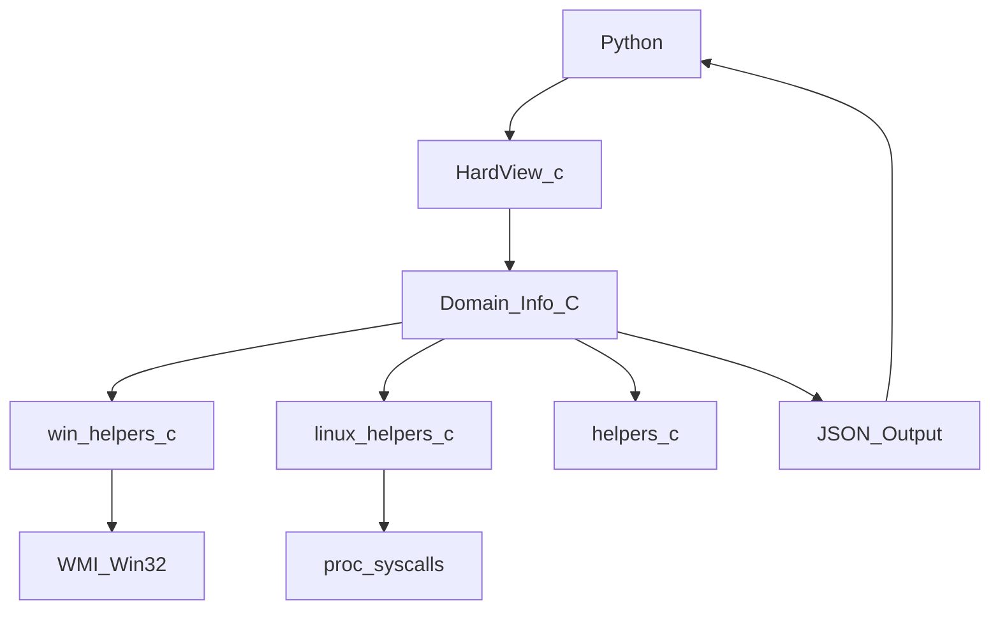

# HardView Library: Architecture & Internals

This document provides a deep technical overview of the HardView library, including its internal structure, data flow, and design principles. It is intended for developers and contributors who want to understand, extend, or maintain the library.

---

## 1. High-Level Architecture

HardView is a native C library with a Python extension interface. It is designed for:
- **Performance:** Direct system calls, minimal overhead, native code
- **Extensibility:** Modular codebase, easy to add new hardware domains or platforms
- **Reliability:** Robust error handling, memory safety, and clear separation of concerns

---

## 2. Data Flow: From System to Python

1. **Python Call:** User calls a function in the Python module (e.g., `get_cpu_info_json()`)
2. **C Extension Entry Point:** The Python binding in `HardView.c` receives the call and dispatches to the appropriate C function
3. **Platform Abstraction:**
    - On Windows: Calls WMI/Win32 API via COM interfaces
    - On Linux: Reads from `/proc`, `/sys`, or uses system calls
4. **Data Collection:** The relevant module (e.g., `cpu_info.c`) queries the system, collects and parses the data
5. **JSON Formatting:** Data is formatted into a JSON string using helpers (with proper escaping and memory management)
6. **Return to Python:** The JSON string is returned to Python, where it can be parsed with `json.loads()`

---

## 3. Module Structure & Interaction

- **helpers.c/h:**
  - JSON string creation, string escaping, utility functions
- **win_helpers.c/h:**
  - WMI/COM initialization, cleanup, error translation (Windows only)
- **linux_helpers.c/h:**
  - Linux-specific helpers (planned/partial)
- **[domain]_info.c/h:**
  - One pair per hardware domain (bios, system, baseboard, chassis, cpu, ram, disk, network, etc.)
  - Each implements data collection and JSON formatting for its domain
- **performance_monitor.c/h:**
  - Real-time and interval-based monitoring (CPU, RAM, system)
- **advanced_storage_info.c/h, Smart_disk.c/h:**
  - Advanced disk/partition/SMART info
- **HardView.c/h:**
  - Main entry point, Python C extension interface, function registration

**Interaction:**
- Each domain module is self-contained and only interacts with helpers and platform-specific helpers
- The main entry point (HardView.c) exposes all public functions to Python

---

## 4. Error Handling & Propagation

- All system/API calls are checked for errors (HRESULT, NULL pointers, etc.)
- On error, a JSON string with an `"error"` field is returned (e.g., `{ "error": "Failed to initialize WMI" }`)
- COM objects and system resources are always released, even on error
- Errors propagate up to Python as JSON, so the user can handle them easily

---

## 5. Memory Management & Safety

- All returned JSON strings are heap-allocated (`malloc`) and must be freed by the Python wrapper (handled automatically)
- Internal buffers are sized conservatively and checked for overflows
- Temporary allocations (e.g., for string escaping) are always freed after use
- No global state is used, minimizing risk of memory leaks or corruption

---

## 6. Thread Safety

- The library is **not inherently thread-safe** (as WMI/COM and some system APIs are not thread-safe by default)
- If used in multi-threaded Python code, calls should be serialized or protected by the GIL (which is the default for CPython extensions)
- No global mutable state is used

---

## 7. Adding New Platforms

To add support for a new OS/platform:
1. Create new platform-specific helpers (e.g., `mac_helpers.c/h`)
2. Implement domain modules for the new platform (e.g., `cpu_info_mac.c`)
3. Use preprocessor macros (`#ifdef __APPLE__`, etc.) to select the correct implementation
4. Update the build system (e.g., `setup.py`) to include/exclude files as needed
5. Add tests and documentation

---

## 8. Adding New Hardware Domains

1. Create a new `[domain]_info.c/h` file pair
2. Implement data collection and JSON formatting for the new domain
3. Register the new function in `HardView.c/h` for Python exposure
4. Update documentation and add usage examples

---

## 9. Data Flow Diagram



---

## 10. Example File Structure

```
src/
  helpers.c/h
  win_helpers.c/h
  linux_helpers.c/h
  bios_info.c/h
  system_info.c/h
  baseboard_info.c/h
  chassis_info.c/h
  cpu_info.c/h
  ram_info.c/h
  disk_info.c/h
  network_info.c/h
  performance_monitor.c/h
  advanced_storage_info.c/h
  Smart_disk.c/h
  HardView.c/h
```

---

## 11. References
- [Microsoft WMI Documentation](https://docs.microsoft.com/en-us/windows/win32/wmisdk/wmi-start-page)
- [Win32 API Reference](https://docs.microsoft.com/en-us/windows/win32/api/)
- [CPython C API](https://docs.python.org/3/c-api/)

---

For further questions or contributions, see the main README or contact the maintainer. 
